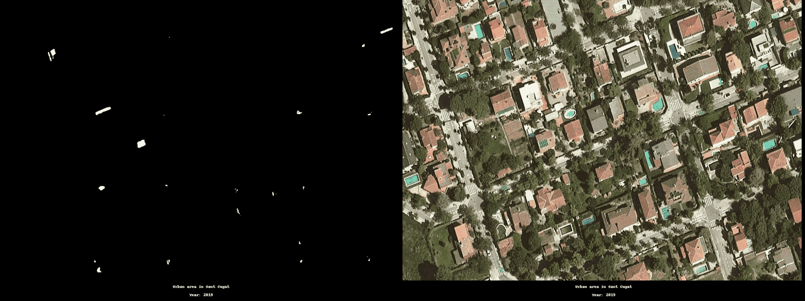

# Solar Panel Detector

Project

Postgraduate in Ai and Deep Learning (UPC)

Barcelona, July 2024

# Table of Contents:

1. [**Introduction**](#introduction)
2. [**Motivation**](#motivation)
3. [**Objectives and Approach**](#objectives-and-approach)
4. [**Project plan and milestones**](#project-plan-and-milestones)
5. [**Phase 1 - Datasets**](#phase-1---datasets)
6. [**Phase 1 - Architectures**](#phase-1---architectures)
   1. [U-Net](#u-net)
   2. [SegFormer](#segformer)
7. [**Phase 1 - Experiments and Results**](#phase-1---experiments-and-results)
   1. [Evaluation metrics](#evaluation-metrics)
   2. [U-Net Experiments](#phase-1---u-net-experiments)
   3. [Segformer Experiments](#phase-1-segformer-experiments)
   4. [Inference](#phase-1-inference)
8. [**Phase 2 - Generalisation**](#phase-2---generalisation)
   1. [ICGC dataset](#icgc-dataset)
   2. [Checkpoint](#checkpoint)
9. [**Phase 2 - New training dataset**](#phase-2---new-training-dataset)
10. [**Phase 2 - Experiments and Results**](#phase-2---experiments-and-results)
    1. [U-Net Experiments](#phase-2---u-net-experiments)
    2. [SegFormer Experiments](#phase-2---segformer-experiments)
    3. [Checkpoint](#checkpoint-1)
    4. [Inference](#phase-2---inference)
11. [**Statistics**](#statistics)
12. [**Conclusions**](#conclusions)
13. [**Next steps**](#next-steps)
14. [**APPENDIX A - How to run the code**](#appendix-a---how-to-run-the-code)
    1. [A.1 From Python files](#from-python-files)
    2. [A.2 From Google Colab Notebooks](#from-google-colab-notebooks)
15. [**APPENDIX B - References**](#appendix-b---references)

<br>

# Introduction

This is the final project for the spring 2024 postgraduate course on
Artificial Intelligence with Deep Learning, UPC School, developed by
[Raphael Gagliardi](mailto:raphael.gagliardi@gmail.com),
[David Pastor](mailto:david.pastor.c@gmail.com),
[Daniel Domingo](mailto:dani.domingo@gmail.com)
and [Manel Toril](mailto:manel.toril@gmail.com).
The project has been advised by [Amanda Duarte](mailto:mandacduarte2@gmail.com).

In this project we build a solar panel detector using AI and deep
learning techniques, and use it to produce photovoltaic (PV)
installation growth statistics in a given territory.

**Note**: Please refer to the [Appendix
A](#appendix-a---how-to-run-the-code) to see details and
instructions to run the code developed during the project.

# Motivation

Our primary motivation for developing this project is to improve energy
management, environmental conservation, and urban planning. We aim to
accomplish this by offering citizens and local entities (both public and
private) access to accurate and up-to-date statistical data on the
growth of PV panel installations over time in a specific region of
interest. This data provides valuable information for creating
sustainable energy plans and business opportunities.

With solar panels, we help decarbonize electricity production, reducing
atmospheric pollution and contributing to cleaner water and air. By
detecting solar panels, we can assess our progress in meeting the goals
of the [Paris Climate
Agreement](https://unfccc.int/process-and-meetings/the-paris-agreement)
and the [UN Sustainable Development
Goals](https://www.un.org/sustainabledevelopment/sustainable-development-goals/):


We will apply AI for good with this project.

# Objectives and Approach

The **first objective** of this project is to **detect solar panels in
aerial or satellite photos**.

Our approach will involve two phases:

1.  Develop a solar panel detector by training AI models on existing
    labelled datasets of satellite images and masks, using semantic
    segmentation techniques. We will train two models: one built from
    scratch and another fine-tuned from a pretrained model.
    
    We decided to use semantic segmentation, following recommendations
    from the paper *Multi-resolution Dataset for Photovoltaic Panel
    Segmentation from Satellite and Aerial Imagery (Hou Jiang et
    al.)*[^1]. This methodology allows us to make predictions at a pixel
    level, which helps us not only detect if there is a solar panel in the
    image (which could also be achieved with binary classification) and
    determine its location (which could also be achieved with object
    classification), but also identify its shape. Identifying the shape is
    something that can only be achieved with semantic segmentation and is
    essential for calculating the area of the panel and producing
    statistical data (as outlined in the second objective below).

2.  Apply the trained models to unlabeled images from another region of
    interest (generalisation) in nearby locations
    

Global data shows that the adoption of solar energy has grown
exponentially worldwide over the last 15 years, driven by the steadily
decreasing cost of solar technology and supportive governmental
policies.


Source:
[OurWorldInData.org](https://ourworldindata.org/grapher/solar-energy-consumption-by-region)

The **second objective** of this project is to demonstrate that the
global trend of solar energy adoption is also applicable at a local
scale. We will achieve this by **producing statistical data** on the
growth of PV panel installations over time in nearby areas, using the
best AI models developed in the first phase.

AI can be applied to this use case as a frequent and efficient method of
data acquisition, in contrast to traditional methods like local surveys
and reports from various sources, which are often time-consuming,
outdated, and incomplete.

# Project plan and milestones

After defining the scope of the project and conducting an initial
analysis, we established a waterfall schedule with two phases and the
following milestones:

-   **Phase 1** (Build the detector):

    -   Identify, download, and process a labelled dataset suitable for
        our task.

    -   Train a model from scratch using the UNet architecture.

    -   Fine-tune a pre-trained model on semantic segmentation for our
        specific task using the Segformer architecture.

    -   Test and select the best models based on relevant metrics

-   **Phase 2** (Generalise):

    -   Identify, download, and process an unlabeled dataset from a
        nearby region of interest.

    -   Define a statistical model and produce data over a period of
        time using the models from Phase 1.

Shortly after starting the project, we divided our efforts to run
experiments on both UNet and Segformer in parallel. This approach saved
time and allowed us to learn from each other's progress. Consequently,
we completed Phase 1 about a week earlier than planned, which proved
essential for Phase 2.

At the beginning of Phase 2, we realised that our models were not
generalising well. To address this, we introduced additional steps to
find a solution using a new dataset and conducted a new set of
experiments.

Despite these challenges, we managed to catch up with the original
timeline and successfully completed the project, achieving all the
milestones.


# Phase 1 - Datasets

**Dataset selection**

After a period of research, we evaluated 3 different options:

1. **Create our own dataset**:
   This option was quickly discarded as we would not have enough time
   during the project to identify suitable images and manually produce
   high-quality masks.
2. Use a dataset of **PV panels from cities in California**:
   Referenced from the publication *Distributed Solar Photovoltaic Array
   Location and Extent Data Set for Remote Sensing Object Identification
   (Kyle Bradbury, Raghav Saboo et al.)*[^2]. This dataset contains
   59,800 images (500 x 500 pixels) with corresponding segmentation masks
   covering four areas of California. It includes the percentage of
   pixels occupied by solar panels in each image. We discarded this
   dataset because we believed it was too specific to the characteristics
   of that region and would probably not generalise well to other
   locations.
3. Use a dataset of **PV panels on different land typologies in China**:
   Referenced from *Multi-resolution dataset for photovoltaic panel
   segmentation from satellite and aerial imagery (Hou Jiang et. al)*[^3]
   paper. This dataset was selected because it contained a higher variety
   of shapes and backgrounds, which we believed would work better for
   generalisation.
   
   *Organisational structure of PV01 and PV03 dataset*
   
   *Original Area where PV01 and PV03 are obtained*

The dataset includes 2 groups of PV images and masks classified by panel support structure:

-   PV03 from aerial photography, obtained from aerial photographs,
    contains 2,308 images of 1024 x 1024 px, with a spatial resolution
    of 0.3m. Ground samples are divided into five categories according
    to their background land use type: shrub land, grassland, cropland,
    saline-alkali, and water surface.

    

    *Example of PV03 from aerial photography (land)*

-   PV01 from UAV orthophotos, obtained by unmanned aerial vehicles,
    contains 645 images of 256 x 256 px, with a spatial resolution of
    0.1m. Rooftop samples are divided into three categories according to
    their background roof type: flat concrete, steel tile, and brick.

    

    *Example of PV01 from UAV*

**Dataset preprocessing**

**Extract**

PV01 and PV03 datasets were downloaded from: [https://zenodo.org/records/5171712](https://zenodo.org/records/5171712)

**Crop**

We decided to use 256 x 256 px patches for training. To maintain the
spatial resolution of the source images, we cropped the images from the
PV03 dataset (originally 1024 x 1024 px) into 16 patches each. The PV01
dataset already contained 256 x 256 px images, so no cropping was
necessary.


*Cropping of PV03 dataset*

**Split**

The dataset was splitted using the following distribution (total
patches: **37,573**):

| **Train (60%)** | **Validation (20%)** | **Test (20%)** |
| --- | --- | --- |
| **22,543** | **7,515** | **7,515** |

**Organise**

Split files were saved and organised in local folders.

**Normalise**

Masks values were normalised, converting them to grayscale first and
applying a threshold afterwards: from 0 to 80: black, from 81 to 255:
white.

**Augmentation**

Our dataset, especially PV01, did not have a large set of images. Data
augmentation can help compensate for this, artificially expanding the
dataset size and variability.

These are the techniques we used (implemented within the dataset class
in the code), appling randomly:

-   **Flip**: Horizontally or vertically flips the image to create
    mirrored versions.

-   **Rotation**: Rotate the image by a specified angle to introduce
    orientation variance.

-   **Brightness**: Adjust the brightness level of the image to simulate
    different lighting conditions.

-   **Contrast**: Modify the contrast of the image, enhancing or
    reducing the difference between light and dark areas.

-   **Saturation**: Alter the intensity of colours in the image to vary
    the vividness.

-   **Hue**: Shift the colour tones of the image by adjusting the hue
    channel.

-   **Blur**: Apply a blur effect to the image to reduce sharpness and
    simulate out-of-focus conditions.

-   **Sharpen**: Enhance the edges and details in the image to increase
    clarity.

-   **Gaussian Noise**: Add random Gaussian noise to the image to mimic
    sensor noise and improve robustness.

# Phase 1 - Architectures

We wanted to experiment by training two architectures: one built from
scratch and another fine-tuned from a pretrained model on semantic
segmentation. We built a U-Net model from scratch, as it is convenient
for image processing, and fine-tuned a modern architecture based on
transformers, Segformer, to compare their performance and results at the
end of the experiments.

## U-Net

In our project, we implemented the U-Net[^4] architecture from scratch
(not pre-trained): defined the encoder and decoder blocks, integrated
skip connections between corresponding layers, and assembled these
components to create a complete convolutional neural network designed
for image segmentation.

The U-Net architecture enables precise segmentation by maintaining small
details and effectively combining low-level and high-level features,
which is exactly what we needed for our task.


## SegFormer

In the context of solar panel detection, the modern SegFormer
architecture offers a powerful and efficient solution for semantic
segmentation. It combines Transformers with lightweight multilayer
perceptron (MLP) decoders.


Source: [Architecture of Segformer. HuggingFace](https://github.com/huggingface/transformers/blob/main/docs/source/en/model_doc/segformer.md)

In order to fine-tune a Segformer pretrained model, we have followed the
guidance from the following blog linked from Hugging Face by **Tobias Cornille** and **Niels Rogge**: [Fine-Tune a Semantic Segmentation Model with a Custom Dataset](https://huggingface.co/blog/fine-tune-segformer?_sm_vck=qJJ5D3Z3r78NP64qSF3H58QrtN8s6s4jq0SRHsH3PsDD3Mk1NQ4R)

The SegFormer models come in various sizes, from 3.8 million parameters (B0) to 64 million parameters (B4), accommodating different computational and performance needs. For solar panel detection, we will use a pre-trained SegFormer model (nvidia/segformer-b0-finetuned-ade-512-512) from the Hugging Face Transformers library[^5]. We will fine-tune this model by modifying the final classification layer to focus on our two classes (solar panels and background) and retrain it on a labelled dataset. This process will adapt the model to detect solar panels while leveraging the features learned during pre-training.

# Phase 1 - Experiments and Results

All training was conducted on both architectures to evaluate the results
by independently modifying the parameters. This allowed us to compare
the performance and outcomes between the two architectures.

## Evaluation metrics

During the experiments, we will evaluate the similarity between the
predicted masks and the annotated masks in the training database using
two specific metrics for semantic segmentation: the Dice Coefficient
(F1-Score) and the Jaccard Index (IoU).

These metrics are ideal for our solar panel task because they provide
comprehensive evaluations of segmentation performance. The Dice
Coefficient balances both precision and recall, while the Jaccard Index
offers a straightforward assessment of overlap accuracy (reference [^6]).

**Dice Coefficient (F1-Score)**

The Dice Coefficient, also known as the F1-Score or Sørensen-Dice index,
is one of the most widespread metrics for performance measurement in
computer vision and Medical Image Segmentation (MIS). It is calculated
from the precision and recall of a prediction, scoring the overlap
between predicted segmentation and ground truth while penalising false
positives.


Dice Coefficient is more sensitive to small regions, penalising false
positives but it's less intuitive.

**Jaccard Index (IoU)**

The Jaccard Index, also known as Intersection over Union (IoU), is a
metric used to evaluate the accuracy of a predicted segmentation by
comparing it to the ground truth, providing a clear measure of overlap
accuracy. It is calculated as the area of the intersection divided by
the area of the union of the predicted segmentation and the ground
truth.


Jaccard index is a better metric measuring similarity and it's more
conservative.

## Phase 1 - U-Net Experiments

<table>
<colgroup>
<col style="width: 10%" />
<col style="width: 13%" />
<col style="width: 9%" />
<col style="width: 9%" />
<col style="width: 10%" />
<col style="width: 6%" />
<col style="width: 13%" />
<col style="width: 7%" />
<col style="width: 6%" />
<col style="width: 13%" />
</colgroup>
<thead>
<tr>
<th colspan="10" style="text-align: left; background-color:#474747"><strong>Experiment #1:</strong></th>
</tr>
<tr>
<th colspan="10" style="text-align: center; background-color:#575757">Hypothesis</th>
</tr>
<tr>
<th colspan="10" style="font-weight:normal">In this experiment we trained a U-Net network from
scratch using the preprocessed PV01+ PV03 dataset to 256x256 pixels
(after PV03 cropping). No augmentation was included as a starting
point.</th>
</tr>
<tr>
<th colspan="10" style="text-align: center; background-color:#575757">Setup</th>
</tr>
<tr>
<th style="text-align: center;">GPU</th>
<th style="text-align: center;">Dataset</th>
<th style="text-align: center;">Model ver.</th>
<th style="text-align: center;">Train epochs</th>
<th style="text-align: center;">Valid epochs</th>
<th style="text-align: center;">Batch Size</th>
<th style="text-align: center;">LR</th>
<th colspan="2" style="text-align: center;"><p>Loss</p>
<p>Optim.</p></th>
<th style="text-align: center;">Optim</th>
</tr>
<tr>
<th style="text-align: center; font-weight: normal;">Colab A100</th>
<th style="text-align: center; font-weight: normal;">PV01+ PV03<br>training: 22,543
valid:7,515<br>test:7,515</th>
<th style="text-align: center; font-weight: normal;">UNet 64-128-256-512-1024</th>
<th style="text-align: center; font-weight: normal;">20</th>
<th style="text-align: center; font-weight: normal;">20</th>
<th style="text-align: center; font-weight: normal;">8</th>
<th style="text-align: center; font-weight: normal;">1E-04</th>
<th colspan="2" style="text-align: center; font-weight: normal;">Binary Cross-Entropy</th>
<th style="text-align: center; font-weight: normal;">Adam</th>
</tr>
<tr>
<th colspan="10" style="text-align: center; background-color:#575757">Results</th>
</tr>
<tr>
<th colspan="3" style="text-align: center;">Duration</th>
<th colspan="3" style="text-align: center;">F1</th>
<th colspan="4" style="text-align: center;">Jaccard</th>
</tr>
<tr>
<th colspan="3" style="text-align: center; font-weight: normal;">4h30m</th>
<th colspan="3" style="text-align: center; font-weight: normal;">0.9583</th>
<th colspan="4" style="text-align: center; font-weight: normal;">0.9296</th>
</tr>
<tr>
<th colspan="10" style="text-align: left; font-weight: normal;"><p>Training and
validation loss:</p>
<p></p></th>
</tr>
<tr>
<th colspan="10" style="text-align: center; background-color:#575757">Conclusions</th>
</tr>
<tr>
<th colspan="10" style="font-weight: normal;">One of the first trainings developed. Although
the metrics of accuracy seem to be quite good, the loss seems to overfit
since epoch 7. We proposed several changes from identifying what was the
behaviour with more epochs until changing the batch size and other
hyperparameters.</th>
</tr>
</thead>
</table>

<br>

<table>
<colgroup>
<col style="width: 10%" />
<col style="width: 13%" />
<col style="width: 9%" />
<col style="width: 9%" />
<col style="width: 10%" />
<col style="width: 6%" />
<col style="width: 13%" />
<col style="width: 7%" />
<col style="width: 6%" />
<col style="width: 13%" />
</colgroup>
<thead>
<tr>
<th colspan="10" style="text-align: left; background-color:#474747"><strong>Experiment #2</strong></th>
</tr>
<tr>
<th colspan="10" style="text-align: center; background-color:#575757">Hypothesis</th>
</tr>
<tr>
<th colspan="10" style="font-weight: normal;">U-Net network trained from scratch using the
preprocessed PV01 dataset to 256x256 pixels. Augmentation of random flip
and rotation is added to see the impact</th>
</tr>
<tr>
<th colspan="10" style="text-align: center; background-color:#575757">Setup</th>
</tr>
<tr>
<th style="text-align: center;">GPU</th>
<th style="text-align: center;">Dataset</th>
<th style="text-align: center;">Model ver.</th>
<th style="text-align: center;">Train epochs</th>
<th style="text-align: center;">Valid epochs</th>
<th style="text-align: center;">Batch Size</th>
<th style="text-align: center;">LR</th>
<th colspan="2" style="text-align: center;"><p>Loss</p>
<p>Optim.</p></th>
<th style="text-align: center;">Optim</th>
</tr>
<tr>
<th style="text-align: center; font-weight: normal;">Colab A100</th>
<th style="text-align: center; font-weight: normal;"><p>PV01 Train: 387</p>
<p>Val: 129</p>
<p>Test: 129</p></th>
<th style="text-align: center; font-weight: normal;">UNet 64-128-256-512-1024</th>
<th style="text-align: center; font-weight: normal;">35</th>
<th style="text-align: center; font-weight: normal;">35</th>
<th style="text-align: center; font-weight: normal;">64</th>
<th style="text-align: center; font-weight: normal;">1E-04</th>
<th colspan="2" style="text-align: center; font-weight: normal;">Binary Cross-Entropy</th>
<th style="text-align: center; font-weight: normal;">Adam</th>
</tr>
<tr>
<th colspan="10" style="text-align: center; background-color:#575757">Results</th>
</tr>
<tr>
<th colspan="3" style="text-align: center;">Duration</th>
<th colspan="3" style="text-align: center;">F1</th>
<th colspan="4" style="text-align: center;">Jaccard</th>
</tr>
<tr>
<th colspan="3" style="text-align: center; font-weight: normal;">20 min</th>
<th colspan="3" style="text-align: center; font-weight: normal;">0.9514</th>
<th colspan="4" style="text-align: center; font-weight: normal;">0.9088</th>
</tr>
<tr>
<th colspan="10" style="text-align: left; font-weight: normal;"><p>Training and validation loss:</p>
<p></p></th>
</tr>
<tr>
<th colspan="10" style="text-align: center; background-color:#575757">Conclusions</th>
</tr>
<tr>
<th colspan="10" style="font-weight: normal;">Adding augmentation during the training phase improves the metrics dice and jaccard, however, some peaks have been
found in validation loss being less smooth than expected. Our goal is to
increase the types of augmentation to check the impact and continue
improving metrics.</th>
</tr>
</thead>
<tbody>
</tbody>
</table>

<br>

<table>
<colgroup>
<col style="width: 10%" />
<col style="width: 13%" />
<col style="width: 9%" />
<col style="width: 9%" />
<col style="width: 10%" />
<col style="width: 6%" />
<col style="width: 13%" />
<col style="width: 7%" />
<col style="width: 6%" />
<col style="width: 13%" />
</colgroup>
<thead>
<tr>
<th colspan="10" style="text-align: left; background-color:#474747"><strong>Experiment #3</strong></th>
</tr>
<tr>
<th colspan="10" style="text-align: center; background-color:#575757">Hypothesis</th>
</tr>
<tr>
<th colspan="10" style="font-weight: normal;" >In this experiment we trained a U-Net network from scratch using the preprocessed PV01+PV03 dataset to 256x256 pixels
(after PV03 cropping). From previous experiments we increased the number
of epochs and the batch size. No augmentation was included, it was
considered that the large number of training dataset would be
enabled.</th>
</tr>
<tr>
<th colspan="10" style="text-align: center; background-color:#575757">Setup</th>
</tr>
<tr>
<th style="text-align: center;">GPU</th>
<th style="text-align: center;">Dataset</th>
<th style="text-align: center;">Model ver.</th>
<th style="text-align: center;">Train epochs</th>
<th style="text-align: center;">Valid epochs</th>
<th style="text-align: center;">Batch Size</th>
<th style="text-align: center;">LR</th>
<th colspan="2" style="text-align: center;"><p>Loss</p>
<p>Optim.</p></th>
<th style="text-align: center;">Optim</th>
</tr>
<tr>
<th style="text-align: center; font-weight: normal;">Colab A100</th>
<th style="text-align: center; font-weight: normal;">PV01+PV03 training: 22,543<br>
valid:7,515<br>test:7,515</th>
<th style="text-align: center; font-weight: normal;">UNet
64-128-256-512-1024</th>
<th style="text-align: center; font-weight: normal;">35</th>
<th style="text-align: center; font-weight: normal;">35</th>
<th style="text-align: center; font-weight: normal;">64</th>
<th style="text-align: center; font-weight: normal;">1E-04</th>
<th colspan="2" style="text-align: center; font-weight: normal;">Binary
Cross-Entropy</th>
<th style="text-align: center; font-weight: normal;">Adam</th>
</tr>
<tr>
<th colspan="10" style="text-align: center; background-color:#575757">Results</th>
</tr>
<tr>
<th colspan="3" style="text-align: center;">Duration</th>
<th colspan="3" style="text-align: center;">F1</th>
<th colspan="4" style="text-align: center;">Jaccard</th>
</tr>
<tr>
<th colspan="3" style="text-align: center; font-weight: normal;">10h</th>
<th colspan="3" style="text-align: center; font-weight: normal;">0.9768</th>
<th colspan="4" style="text-align: center; font-weight: normal;">0.9548</th>
</tr>
<tr>
<th colspan="10" style="text-align: left; font-weight: normal;"><p>Training and validation loss:<br />
</p>
<p></p></th>
</tr>
<tr>
<th colspan="10" style="text-align: center; background-color:#575757">Conclusions</th>
</tr>
<tr>
<th colspan="10" style="font-weight: normal;">There are some spikes in the Val loss before the
15 epochs, later on there is a decrease and is more stable. Although it
seems to overfit too, the increase of batch size apparently gives more
stability. The metrics results were all over 90% however we tried some
generalisation tests with images from ICGC and Google maps with images
of the same size (256x256) and spatial resolution (about 0.12 m/pixel)
and the model was not able to detect the PV panels. The experiment does
not generalise with other images. Training the model from scratch
requires a big amount of resources, mostly expending time in
validation.</th>
</tr>
</thead>
<tbody>
</tbody>
</table>

<br>

<table>
<colgroup>
<col style="width: 10%" />
<col style="width: 13%" />
<col style="width: 9%" />
<col style="width: 9%" />
<col style="width: 10%" />
<col style="width: 6%" />
<col style="width: 13%" />
<col style="width: 7%" />
<col style="width: 6%" />
<col style="width: 13%" />
</colgroup>
<thead>
<tr>
<th colspan="10" style="text-align: left; background-color:#474747"><strong>Experiment #4</strong></th>
</tr>
<tr>
<th colspan="10" style="text-align: center; background-color:#575757">Hypothesis</th>
</tr>
<tr>
<th colspan="10" style="font-weight: normal;">Trying to improve previous experiments, we trained a
U-Net network from scratch using the preprocessed PV01+PV03 dataset to
256x256 pixels (after PV03 cropping) but we reduce the number of epoch
of validation (1 epoch of validation out of 5 of training). Continuing
increasing the number of epochs of training, big batch size and
including some data augmentation (flip, random rotation, brightness,
contrast and image saturation).</th>
</tr>
<tr>
<th colspan="10" style="text-align: center; background-color:#575757">Setup</th>
</tr>
<tr>
<th style="text-align: center;">GPU</th>
<th style="text-align: center;">Dataset</th>
<th style="text-align: center;">Model ver.</th>
<th style="text-align: center;">Train epochs</th>
<th style="text-align: center;">Valid epochs</th>
<th style="text-align: center;">Batch Size</th>
<th style="text-align: center;">LR</th>
<th colspan="2" style="text-align: center;"><p>Loss</p>
<p>Optim.</p></th>
<th style="text-align: center;">Optim</th>
</tr>
<tr>
<th style="text-align: center; font-weight: normal;">Colab A100</th>
<th style="text-align: center; font-weight: normal;"><p>PV01 Train: 387</p>
<p>Val: 129</p>
<p>Test: 129</p></th>
<th style="text-align: center; font-weight: normal;">UNet 64-128-256-512-1024</th>
<th style="text-align: center; font-weight: normal;">50</th>
<th style="text-align: center; font-weight: normal;">10</th>
<th style="text-align: center; font-weight: normal;">64</th>
<th style="text-align: center; font-weight: normal;">1E-04</th>
<th colspan="2" style="text-align: center; font-weight: normal;">Binary Cross-Entropy</th>
<th style="text-align: center; font-weight: normal;">Adam</th>
</tr>
<tr>
<th colspan="10" style="text-align: center; background-color:#575757">Results</th>
</tr>
<tr>
<th colspan="3" style="text-align: center;">Duration</th>
<th colspan="3" style="text-align: center;">F1</th>
<th colspan="4" style="text-align: center;">Jaccard</th>
</tr>
<tr>
<th colspan="3" style="text-align: center; font-weight: normal;">4h40m</th>
<th colspan="3" style="text-align: center; font-weight: normal;">0.9732</th>
<th colspan="4" style="text-align: center; font-weight: normal;">0.9479</th>
</tr>
<tr>
<th colspan="10" style="text-align: left; font-weight: normal;"><p>Training and validation loss:</p>
<p></p></th>
</tr>
<tr>
<th colspan="10" style="text-align: center; background-color:#575757">Conclusions</th>
</tr>
<tr>
<th colspan="10" style="font-weight: normal;">Training is smoother. Accuracy values are above
94% however it didn´t generalise over ICGC and Google maps with images
of the same size (256x256) and spatial resolution (about 0.12 m/pixel).
We have identified that validating only every epoch requires less
computational resources and still it gives good results. Introducing
some data augmentation also improves values. Lack of generalisation with
such good metrics makes us think that something is wrong in all the
process.</th>
</tr>
</thead>
<tbody>
</tbody>
</table>

<br>

<table>
<colgroup>
<col style="width: 10%" />
<col style="width: 13%" />
<col style="width: 9%" />
<col style="width: 9%" />
<col style="width: 10%" />
<col style="width: 6%" />
<col style="width: 13%" />
<col style="width: 7%" />
<col style="width: 6%" />
<col style="width: 13%" />
</colgroup>
<thead>
<tr>
<th colspan="10" style="text-align: left; background-color:#474747""><strong>Experiment #5</strong></th>
</tr>
<tr>
<th colspan="10" style="text-align: center; background-color:#575757">Hypothesis</th>
</tr>
<tr>
<th colspan="10" style="font-weight: normal;">The objective was to verify the behaviour using only PV03. At this stage, we were testing the models with different data, and it was our first time running them with only PV03. Additionally, we used augmentation only in images with solar panels. This experiment was to test whether with just PV03 generalisation would occur.</th>
</tr>
<tr>
<th colspan="10" style="text-align: center; background-color:#575757">Setup</th>
</tr>
<tr>
<th style="text-align: center;">GPU</th>
<th style="text-align: center;">Dataset</th>
<th style="text-align: center;">Model ver.</th>
<th style="text-align: center;">Train epochs</th>
<th style="text-align: center;">Valid epochs</th>
<th style="text-align: center;">Batch Size</th>
<th style="text-align: center;">LR</th>
<th colspan="2" style="text-align: center;"><p>Loss</p>
<p>Optim.</p></th>
<th style="text-align: center;">Optim</th>
</tr>
<tr>
<th style="text-align: center; font-weight: normal;">Colab A100</th>
<th style="text-align: center; font-weight: normal;"><p>PV03</p>
<p>Train:22156</p>
<p>Val: 7386 Test: 7386</p></th>
<th style="text-align: center; font-weight: normal;">UNet 64-128-256-512-1024</th>
<th style="text-align: center; font-weight: normal;">50</th>
<th style="text-align: center; font-weight: normal;">10</th>
<th style="text-align: center; font-weight: normal;">64</th>
<th style="text-align: center; font-weight: normal;">1E-04</th>
<th colspan="2" style="text-align: center; font-weight: normal;">Binary Cross-Entropy</th>
<th style="text-align: center; font-weight: normal;">Adam</th>
</tr>
<tr>
<th colspan="10" style="text-align: center; background-color:#575757">Results</th>
</tr>
<tr>
<th colspan="3" style="text-align: center;">Duration</th>
<th colspan="3" style="text-align: center;">F1</th>
<th colspan="4" style="text-align: center;">Jaccard</th>
</tr>
<tr>
<th colspan="3" style="text-align: center; font-weight: normal;">5h</th>
<th colspan="3" style="text-align: center; font-weight: normal;">0.9735</th>
<th colspan="4" style="text-align: center; font-weight: normal;">0.9484</th>
</tr>
<tr>
<th colspan="10" style="text-align: left; font-weight: normal;"><p>Training and validation loss:</p>
<p></p></th>
</tr>
<tr>
<th colspan="10" style="text-align: center; background-color:#575757">Conclusions</th>
</tr>
<tr>
<th colspan="10" style="font-weight: normal;">Accuracy values are above 97% however it didn´t generalise over  ICGC and Google maps with images of the same size (256x256) and spatial resolution (about 0.12 m/pixel). Introducing some data augmentation also improves values. Preparation for the next experiment.</th>
</tr>
</thead>
<tbody>
</tbody>
</table>

<br>

<table>
<colgroup>
<col style="width: 10%" />
<col style="width: 13%" />
<col style="width: 9%" />
<col style="width: 9%" />
<col style="width: 10%" />
<col style="width: 6%" />
<col style="width: 13%" />
<col style="width: 7%" />
<col style="width: 6%" />
<col style="width: 13%" />
</colgroup>
<thead>
<tr>
<th colspan="10" style="text-align: left; background-color:#474747"><strong>Experiment #6</strong></th>
</tr>
<tr>
<th colspan="10" style="text-align: center; background-color:#575757">Hypothesis</th>
</tr>
<tr>
<th colspan="10" style="font-weight: normal;">The objective was to verify the behaviour using PV03 fine tune with PV01 from experiment #5 with a huge number of epochs to see if the model can perform better. At the moment we are trying different approaches to improve the results and try to make generalisation happen, testing images from Google.</th>
</tr>
<tr>
<th colspan="10" style="text-align: center; background-color:#575757">Setup</th>
</tr>
<tr>
<th style="text-align: center;">GPU</th>
<th style="text-align: center;">Dataset</th>
<th style="text-align: center;">Model ver.</th>
<th style="text-align: center;">Train epochs</th>
<th style="text-align: center;">Valid epochs</th>
<th style="text-align: center;">Batch Size</th>
<th style="text-align: center;">LR</th>
<th colspan="2" style="text-align: center;"><p>Loss</p>
<p>Optim.</p></th>
<th style="text-align: center;">Optim</th>
</tr>
<tr>
<th style="text-align: center; font-weight: normal;">Colab A100</th>
<th style="text-align: center; font-weight: normal;"><p>PV01</p>
<p>Fine-Tune: PV03, exp. #6</p>
<p>Train: 387</p>
<p>Val: 129</p>
<p>Test: 129</p></th>
<th style="text-align: center; font-weight: normal;">UNet 64-128-256-512-1024</th>
<th style="text-align: center; font-weight: normal;">250</th>
<th style="text-align: center; font-weight: normal;">5</th>
<th style="text-align: center; font-weight: normal;">64</th>
<th style="text-align: center; font-weight: normal;">1E-04</th>
<th colspan="2" style="text-align: center; font-weight: normal;">Binary Cross-Entropy</th>
<th style="text-align: center; font-weight: normal;">Adam</th>
</tr>
<tr>
<th colspan="10" style="text-align: center; background-color:#575757">Results</th>
</tr>
<tr>
<th colspan="3" style="text-align: center;">Duration</th>
<th colspan="3" style="text-align: center;">F1</th>
<th colspan="4" style="text-align: center;">Jaccard</th>
</tr>
<tr>
<th colspan="3" style="text-align: center; font-weight: normal;">1h</th>
<th colspan="3" style="text-align: center; font-weight: normal;">0.9687</th>
<th colspan="4" style="text-align: center; font-weight: normal;">0.9393</th>
</tr>
<tr>
<th colspan="10" style="text-align: left; font-weight: normal;"><p>Training and validation loss:</p>
<p></p></th>
</tr>
<tr>
<th colspan="10" style="text-align: center; background-color:#575757">Conclusions</th>
</tr>
<tr>
<th colspan="10" style="font-weight: normal;">Accuracy values are above 96% however it didn´t generalise over  ICGC and Google maps with images of the same size (256x256) and spatial resolution (about 0.12 m/pixel).</th>
</tr>
</thead>
<tbody>
</tbody>
</table>

<br>

## Phase-1 Segformer Experiments

<table>
<colgroup>
<col style="width: 10%" />
<col style="width: 13%" />
<col style="width: 9%" />
<col style="width: 9%" />
<col style="width: 10%" />
<col style="width: 6%" />
<col style="width: 13%" />
<col style="width: 7%" />
<col style="width: 6%" />
<col style="width: 13%" />
</colgroup>
<thead>
<tr>
<th colspan="10" style="text-align: left; background-color:#474747"><strong>Experiment #1: </strong>First experiment to fine tune a Segformer model for solar panel detection.</th>
</tr>
<tr>
<th colspan="10" style="text-align: center; background-color:#575757">Hypothesis</th>
</tr>
<tr>
<th colspan="10" style="font-weight: normal;">Hypothesis is that the model will learn after a few epochs, measured through training and validation loss curves, and through Dice and Jaccard metrics.</th>
</tr>
<tr>
<th colspan="10" style="text-align: center; background-color:#575757">Setup</th>
</tr>
<tr>
<th style="text-align: center;">GPU</th>
<th style="text-align: center;">Dataset</th>
<th style="text-align: center;">Model ver.</th>
<th style="text-align: center;">Train epochs</th>
<th style="text-align: center;">Valid epochs</th>
<th style="text-align: center;">Batch Size</th>
<th style="text-align: center;">LR</th>
<th colspan="2" style="text-align: center;"><p>Loss</p>
<p>Optim.</p></th>
<th style="text-align: center;">Optim</th>
</tr>
<tr>
<th style="text-align: center; font-weight: normal;">Colab T4</th>
<th style="text-align: center; font-weight: normal;">PV01 + PV03</th>
<th style="text-align: center; font-weight: normal;">B0</th>
<th style="text-align: center; font-weight: normal;">10</th>
<th style="text-align: center; font-weight: normal;">10</th>
<th style="text-align: center; font-weight: normal;">8</th>
<th style="text-align: center; font-weight: normal;">1E-04</th>
<th colspan="2" style="text-align: center; font-weight: normal;">Cross-Entropy</th>
<th style="text-align: center; font-weight: normal;">AdamW</th>
</tr>
<tr>
<th colspan="10" style="text-align: center; background-color:#575757">Results</th>
</tr>
<tr>
<th colspan="3" style="text-align: center;">Duration</th>
<th colspan="3" style="text-align: center;">F1</th>
<th colspan="4" style="text-align: center;">Jaccard</th>
</tr>
<tr>
<th colspan="3" style="text-align: center; font-weight: normal;">2h</th>
<th colspan="3" style="text-align: center; font-weight: normal;">0.9735</th>
<th colspan="4" style="text-align: center; font-weight: normal;">0.9484</th>
</tr>
<tr>
<th colspan="10" style="text-align: left; font-weight: normal;"><p>Training and validation loss:</p>
<p></p>
<p>Sample image + ground truth (from PV01):</p>
<p></p>
<p>Predicted mask evolution over epochs:</p>
<p></p>
<p>
We validated that the model not only was able to learn, but was learning quickly, and was able to obtain a 97% Dice score only in 10 epochs, likely due to the high quality of the images. However, we also quickly realised that the ground truth masks from PV03 were not as good as those from PV01, which might impact the ability to predict the shape of the solar panel with higher precision.</p>
<p>Sample image + ground truth (from PV03), where we can see the lack of precision compared to PV01:
</p>
<p></p>
</th>
</tr>
<tr>
<th colspan="10" style="text-align: center; background-color:#575757">Conclusions</th>
</tr>
<tr>
<th colspan="10" style="font-weight: normal;">Accuracy values are above 96% however it didn´t generalise over  ICGC and Google maps with images of the same size (256x256) and spatial resolution (about 0.12 m/pixel).</th>
</tr>
</thead>
<tbody>
</tbody>
</table>

<br>

<table>
<colgroup>
<col style="width: 10%" />
<col style="width: 13%" />
<col style="width: 9%" />
<col style="width: 9%" />
<col style="width: 10%" />
<col style="width: 6%" />
<col style="width: 13%" />
<col style="width: 7%" />
<col style="width: 6%" />
<col style="width: 13%" />
</colgroup>
<thead>
<tr>
<th colspan="10" style="text-align: left; background-color:#474747"><strong>Experiment #2:</strong> Try a more complex Segformer model (B2 vs. B0) on similar epochs.</th>
</tr>
<tr>
<th colspan="10" style="text-align: center; background-color:#575757">Hypothesis</th>
</tr>
<tr>
<th colspan="10" style="font-weight: normal;">Try a more complex Segformer model (B2 vs. B0) on similar epochs.</th>
</tr>
<tr>
<th colspan="10" style="text-align: center; background-color:#575757">Setup</th>
</tr>
<tr>
<th style="text-align: center;">GPU</th>
<th style="text-align: center;">Dataset</th>
<th style="text-align: center;">Model ver.</th>
<th style="text-align: center;">Train epochs</th>
<th style="text-align: center;">Valid epochs</th>
<th style="text-align: center;">Batch Size</th>
<th style="text-align: center;">LR</th>
<th colspan="2" style="text-align: center;"><p>Loss</p>
<p>Optim.</p></th>
<th style="text-align: center;">Optim</th>
</tr>
<tr>
<th style="text-align: center; font-weight: normal;">Colab T4</th>
<th style="text-align: center; font-weight: normal;">PV01+PV03</th>
<th style="text-align: center; font-weight: normal;">B2</th>
<th style="text-align: center; font-weight: normal;">10</th>
<th style="text-align: center; font-weight: normal;">10</th>
<th style="text-align: center; font-weight: normal;">8</th>
<th style="text-align: center; font-weight: normal;">1E-04</th>
<th colspan="2" style="text-align: center;">Binary Cross-Entropy</th>
<th style="text-align: center; font-weight: normal;">AdamW</th>
</tr>
<tr>
<th colspan="10" style="text-align: center; background-color:#575757">Results</th>
</tr>
<tr>
<th colspan="3" style="text-align: center;">Duration</th>
<th colspan="3" style="text-align: center;">F1</th>
<th colspan="4" style="text-align: center;">Jaccard</th>
</tr>
<tr>
<th colspan="3" style="text-align: center; font-weight: normal;">3h</th>
<th colspan="3" style="text-align: center; font-weight: normal;">0.9544</th>
<th colspan="4" style="text-align: center; font-weight: normal;"> 0.9248</th>
</tr>
<tr>
<th colspan="10" style="text-align: left; font-weight: normal;">The experiment execution was aborted by the Colab environm ent at Epoch 10.
</th>
</tr>
<tr>
<th colspan="10" style="text-align: center; background-color:#575757">Conclusions</th>
</tr>
<tr>
<th colspan="10" style="font-weight: normal;">Changing the model did not improve metrics, while execution time increased 50% compared to Experiment #1,so discarded trying even more complex models in upcoming experiments, for the time being.</th>
</tr>
</thead>
<tbody>
</tbody>
</table>

<br>

<table>
<colgroup>
<col style="width: 10%" />
<col style="width: 13%" />
<col style="width: 9%" />
<col style="width: 9%" />
<col style="width: 10%" />
<col style="width: 6%" />
<col style="width: 13%" />
<col style="width: 7%" />
<col style="width: 6%" />
<col style="width: 13%" />
</colgroup>
<thead>
<tr>
<th colspan="10" style="text-align: left; background-color:#575757"><strong>Experiment #3:</strong> Try a more powerful GPU and increase epochs and batch size.</th>
</tr>
<tr>
<th colspan="10" style="text-align: center; background-color:#575757">Hypothesis</th>
</tr>
<tr>
<th colspan="10" style="font-weight: normal;">Hypothesis is that with more powerful capabilities we could increase the batch size and train more epochs with balanced duration. With more epochs, the expectation was that the model would learn more and the metrics would improve</th>
</tr>
<tr>
<th colspan="10" style="text-align: center; background-color:#575757">Setup</th>
</tr>
<tr>
<th style="text-align: center;">GPU</th>
<th style="text-align: center;">Dataset</th>
<th style="text-align: center;">Model ver.</th>
<th style="text-align: center;">Train epochs</th>
<th style="text-align: center;">Valid epochs</th>
<th style="text-align: center;">Batch Size</th>
<th style="text-align: center;">LR</th>
<th colspan="2" style="text-align: center;"><p>Loss</p>
<p>Optim.</p></th>
<th style="text-align: center;">Optim</th>
</tr>
<tr>
<th style="text-align: center; font-weight: normal;">Colab A100</th>
<th style="text-align: center; font-weight: normal;">PV01+PV03</th>
<th style="text-align: center; font-weight: normal;">B0</th>
<th style="text-align: center; font-weight: normal;">35</th>
<th style="text-align: center; font-weight: normal;">7</th>
<th style="text-align: center; font-weight: normal;">64</th>
<th style="text-align: center; font-weight: normal;">1E-04</th>
<th colspan="2" style="text-align: center; font-weight: normal;">Cross-Entropy</th>
<th style="text-align: center; font-weight: normal;">AdamW</th>
</tr>
<tr>
<th colspan="10" style="text-align: center; background-color:#575757">Results</th>
</tr>
<tr>
<th colspan="3" style="text-align: center;">Duration</th>
<th colspan="3" style="text-align: center;">F1</th>
<th colspan="4" style="text-align: center;">Jaccard</th>
</tr>
<tr>
<th colspan="3" style="text-align: center; font-weight: normal;">3h</th>
<th colspan="3" style="text-align: center; font-weight: normal;">0.9733</th>
<th colspan="4" style="text-align: center; font-weight: normal;">0.9482</th>
</tr>
<tr>
<th colspan="10" style="text-align: left; font-weight: normal;"><p>Training and validation loss:</p>
<p></p></th>
</tr>
<tr>
<th colspan="10" style="text-align: center; background-color:#575757">Conclusions</th>
</tr>
<tr>
<th colspan="10" style="font-weight: normal;">We could validate that using more powerful capabilities we had a more balanced experiment duration. Introducing less validation epochs also helped, as a lot of time was consumed calculating the metrics (compared to training epochs).
However, the metrics did not improve, and the training and validation loss, although on a small scale, did not show substantially different patterns compared to Experiment #1.</th>
</tr>
</thead>
<tbody>
</tbody>
</table>

<br>

<table>
<colgroup>
<col style="width: 10%" />
<col style="width: 13%" />
<col style="width: 9%" />
<col style="width: 9%" />
<col style="width: 10%" />
<col style="width: 6%" />
<col style="width: 13%" />
<col style="width: 7%" />
<col style="width: 6%" />
<col style="width: 13%" />
</colgroup>
<thead>
<tr>
<th colspan="10" style="text-align: left; background-color:#474747"><strong>Experiment #3b +#3c:</strong> Try a more complex Segformer model (B1 and B3, vs. B0)</th>
</tr>
<tr>
<th colspan="10" style="text-align: center; background-color:#575757">Hypothesis</th>
</tr>
<tr>
<th colspan="10" style="font-weight: normal;">Hypothesis is that with a more complex model we can get better results</th>
</tr>
<tr>
<th colspan="10" style="text-align: center; background-color:#575757">Setup</th>
</tr>
<tr>
<th style="text-align: center;">GPU</th>
<th style="text-align: center;">Dataset</th>
<th style="text-align: center;">Model ver.</th>
<th style="text-align: center;">Train epochs</th>
<th style="text-align: center;">Valid epochs</th>
<th style="text-align: center;">Batch Size</th>
<th style="text-align: center;">LR</th>
<th colspan="2" style="text-align: center;"><p>Loss</p>
<p>Optim.</p></th>
<th style="text-align: center;">Optim</th>
</tr>
<tr>
<th style="text-align: center; font-weight: normal;">Colab A100</th>
<th style="text-align: center; font-weight: normal;">PV01+PV03</th>
<th style="text-align: center; font-weight: normal;"><p>#3b: B1</p><p>#3c: B3</p></th>
<th style="text-align: center; font-weight: normal;">35</th>
<th style="text-align: center; font-weight: normal;">7</th>
<th style="text-align: center; font-weight: normal;">64</th>
<th style="text-align: center; font-weight: normal;">1E-04</th>
<th colspan="2" style="text-align: center; font-weight: normal;">Cross-Entropy</th>
<th style="text-align: center; font-weight: normal;">AdamW</th>
</tr>
<tr>
<th colspan="10" style="text-align: center; background-color:#575757">Results</th>
</tr>
<tr>
<th colspan="3" style="text-align: center;">Duration</th>
<th colspan="3" style="text-align: center;">F1</th>
<th colspan="4" style="text-align: center;">Jaccard</th>
</tr>
<tr>
<th colspan="3" style="text-align: center; font-weight: normal;"><p>#3b: 2h45m</p><p>#3c: 4h</p></th>
<th colspan="3" style="text-align: center; font-weight: normal;"><p>#3b: 0.9764</p><p>#3c: 0.9775</p></th>
<th colspan="4" style="text-align: center; font-weight: normal;"><p>#3b: 0.9540</p><p>#3c: 0.9562</p></th>
</tr>
<tr>
<th colspan="10" style="text-align: left; font-weight: normal;"><p>Experiment #3b:</p>
<p></p>
<p>Experiment #3c:</p>
<p></p></th>
</tr>
<tr>
<th colspan="10" style="text-align: center; background-color:#575757">Conclusions</th>
</tr>
<tr>
<th colspan="10" style="font-weight: normal;">A slight improvement on dice and jaccard metrics, but validation loss diverges and execution time takes longer. Conclusion is that with a more complex model we don’t get better results.</th>
</tr>
</thead>
<tbody>
</tbody>
</table>

<br>

<table>
<colgroup>
<col style="width: 10%" />
<col style="width: 13%" />
<col style="width: 9%" />
<col style="width: 9%" />
<col style="width: 10%" />
<col style="width: 6%" />
<col style="width: 13%" />
<col style="width: 7%" />
<col style="width: 6%" />
<col style="width: 13%" />
</colgroup>
<thead>
<tr>
<th colspan="10" style="text-align: left; background-color:#474747"><strong>Experiment #3d +#3e:</strong> Try normalisation</th>
</tr>
<tr>
<th colspan="10" style="text-align: center; background-color:#575757">Hypothesis</th>
</tr>
<tr>
<th colspan="10" style="font-weight: normal;">Hypothesis is that with normalisation we can get better results</th>
</tr>
<tr>
<th colspan="10" style="text-align: center; background-color:#575757">Setup</th>
</tr>
<tr>
<th style="text-align: center;">GPU</th>
<th style="text-align: center;">Dataset</th>
<th style="text-align: center;">Model ver.</th>
<th style="text-align: center;">Train epochs</th>
<th style="text-align: center;">Valid epochs</th>
<th style="text-align: center;">Batch Size</th>
<th style="text-align: center;">LR</th>
<th colspan="2" style="text-align: center;"><p>Loss</p>
<p>Optim.</p></th>
<th style="text-align: center;">Optim</th>
</tr>
<tr>
<th style="text-align: center; font-weight: normal;">Colab A100</th>
<th style="text-align: center; font-weight: normal;">PV01+PV03+norm</th>
<th style="text-align: center; font-weight: normal;">B3</th>
<th style="text-align: center; font-weight: normal;">35</th>
<th style="text-align: center; font-weight: normal;">7</th>
<th style="text-align: center; font-weight: normal;">64</th>
<th style="text-align: center; font-weight: normal;">1E-04</th>
<th colspan="2" style="text-align: center; font-weight: normal;">Cross-Entropy</th>
<th style="text-align: center; font-weight: normal;">AdamW</th>
</tr>
<tr>
<th colspan="10" style="text-align: center; background-color:#575757">Results</th>
</tr>
<tr>
<th colspan="3" style="text-align: center;">Duration</th>
<th colspan="3" style="text-align: center;">F1</th>
<th colspan="4" style="text-align: center;">Jaccard</th>
</tr>
<tr>
<th colspan="3" style="text-align: center; font-weight: normal;"><p>#3d: 7h</p><p>#3e: 7h</p></th>
<th colspan="3" style="text-align: center; font-weight: normal;"><p>#3d: 0.9775</p><p>#3e: 0.9769</p></th>
<th colspan="4" style="text-align: center; font-weight: normal;">0.9363</th>
</tr>
<tr>
<th colspan="10" style="text-align: left; font-weight: normal;"><p>Experiment #3d: Normalisation used: mean=(0.2713, 0.2744, 0.2673), std=(0.0243, 0.0196, 0.0226)</p>
<p></p>
<p>Experiment #3e: Normalisation used:mean=(0.2713, 0.2744, 0.2673), std=(0.1558, 0.1399, 0.1502)</p>
<p></p></th>
</tr>
<tr>
<th colspan="10" style="text-align: center; background-color:#575757">Conclusions</th>
</tr>
<tr>
<th colspan="10" style="font-weight: normal;">Same F1 result as E#3e and slightly worse Jaccard value, but the computation cost has been increased a lot (3h more). No noticeable improvement that justifies the additional computational cost.</th>
</tr>
</thead>
<tbody>
</tbody>
</table>

<br>

<table>
<colgroup>
<col style="width: 10%" />
<col style="width: 13%" />
<col style="width: 9%" />
<col style="width: 9%" />
<col style="width: 10%" />
<col style="width: 6%" />
<col style="width: 13%" />
<col style="width: 7%" />
<col style="width: 6%" />
<col style="width: 13%" />
</colgroup>
<thead>
<tr>
<th colspan="10" style="text-align: left; background-color:#474747"><strong>Experiment #4e:</strong> Try fine-tuning the learning rate.</th>
</tr>
<tr>
<th colspan="10" style="text-align: center; background-color:#575757">Hypothesis</th>
</tr>
<tr>
<th colspan="10" style="font-weight: normal;">Hypothesis is that we would be able to find an optimal learning rate applying a scheduler and early stop mechanism.</th>
</tr>
<tr>
<th colspan="10" style="text-align: center; background-color:#575757">Setup</th>
</tr>
<tr>
<th style="text-align: center;">GPU</th>
<th style="text-align: center;">Dataset</th>
<th style="text-align: center;">Model ver.</th>
<th style="text-align: center;">Train epochs</th>
<th style="text-align: center;">Valid epochs</th>
<th style="text-align: center;">Batch Size</th>
<th style="text-align: center;">LR</th>
<th colspan="2" style="text-align: center;"><p>Loss</p>
<p>Optim.</p></th>
<th style="text-align: center;">Optim</th>
</tr>
<tr>
<th style="text-align: center; font-weight: normal;">Colab A100</th>
<th style="text-align: center; font-weight: normal;">PV01+PV03</th>
<th style="text-align: center; font-weight: normal;">B0</th>
<th style="text-align: center; font-weight: normal;">50</th>
<th style="text-align: center; font-weight: normal;">50</th>
<th style="text-align: center; font-weight: normal;">64</th>
<th style="text-align: center; font-weight: normal;">Scheduler + Early Stop start 1E-04</th>
<th colspan="2" style="text-align: center; font-weight: normal;">Cross-Entropy</th>
<th style="text-align: center; font-weight: normal;">AdamW</th>
</tr>
<tr>
<th colspan="10" style="text-align: center; background-color:#575757">Results</th>
</tr>
<tr>
<th colspan="3" style="text-align: center;">Duration</th>
<th colspan="3" style="text-align: center;">F1</th>
<th colspan="4" style="text-align: center;">Jaccard</th>
</tr>
<tr>
<th colspan="3" style="text-align: center; font-weight: normal;">6h</th>
<th colspan="3" style="text-align: center; font-weight: normal;">0.9733</th>
<th colspan="4" style="text-align: center; font-weight: normal;">0.9482</th>
</tr>
<tr>
<th colspan="10" style="text-align: left; font-weight: normal;">Scheduler starting at 1e-4 with 0.1 rate steps + early stop after 5 epochs without improvement - Set up to run for 50 epochs but lost connection to environment at epoch 21 without LR variation.</th>
</tr>
<tr>
<th colspan="10" style="text-align: center; background-color:#575757">Conclusions</th>
</tr>
<tr>
<th colspan="10" style="font-weight: normal;">1E-4 remained stable by scheduler during the first 21 epochs. Dice score and Jaccard did not improve, so the conclusion is that 1E-4 is optimal.</th>
</tr>
</thead>
<tbody>
</tbody>
</table>

<br>

<table>
<colgroup>
<col style="width: 10%" />
<col style="width: 13%" />
<col style="width: 9%" />
<col style="width: 9%" />
<col style="width: 10%" />
<col style="width: 6%" />
<col style="width: 13%" />
<col style="width: 7%" />
<col style="width: 6%" />
<col style="width: 13%" />
</colgroup>
<thead>
<tr>
<th colspan="10" style="text-align: left; background-color:#474747"><strong>Experiment #5:</strong> Try a different learning rate.</th>
</tr>
<tr>
<th colspan="10" style="text-align: center; background-color:#575757">Hypothesis</th>
</tr>
<tr>
<th colspan="10" style="font-weight: normal;">Hypothesis is that a different learning rate will not improve metrics, based on the results from Experiment #4.</th>
</tr>
<tr>
<th colspan="10" style="text-align: center; background-color:#575757">Setup</th>
</tr>
<tr>
<th style="text-align: center;">GPU</th>
<th style="text-align: center;">Dataset</th>
<th style="text-align: center;">Model ver.</th>
<th style="text-align: center;">Train epochs</th>
<th style="text-align: center;">Valid epochs</th>
<th style="text-align: center;">Batch Size</th>
<th style="text-align: center;">LR</th>
<th colspan="2" style="text-align: center;"><p>Loss</p>
<p>Optim.</p></th>
<th style="text-align: center;">Optim</th>
</tr>
<tr>
<th style="text-align: center; font-weight: normal;">Colab A100</th>
<th style="text-align: center; font-weight: normal;">PV01+PV03</th>
<th style="text-align: center; font-weight: normal;">B0</th>
<th style="text-align: center; font-weight: normal;">36</th>
<th style="text-align: center; font-weight: normal;">9</th>
<th style="text-align: center; font-weight: normal;">64</th>
<th style="text-align: center; font-weight: normal;">1E-05</th>
<th colspan="2" style="text-align: center; font-weight: normal;">Cross-Entropy</th>
<th style="text-align: center; font-weight: normal;">AdamW</th>
</tr>
<tr>
<th colspan="10" style="text-align: center; background-color:#575757">Results</th>
</tr>
<tr>
<th colspan="3" style="text-align: center;">Duration</th>
<th colspan="3" style="text-align: center;">F1</th>
<th colspan="4" style="text-align: center;">Jaccard</th>
</tr>
<tr>
<th colspan="3" style="text-align: center; font-weight: normal;">3h30m</th>
<th colspan="3" style="text-align: center; font-weight: normal;">0.9712</th>
<th colspan="4" style="text-align: center; font-weight: normal;">0.9441</th>
</tr>
<tr>
<th colspan="10" style="text-align: left; font-weight: normal;">Adding a few more validation steps for more granularity in the evaluation results.</th>
</tr>
<tr>
<th colspan="10" style="text-align: center; background-color:#575757">Conclusions</th>
</tr>
<tr>
<th colspan="10" style="font-weight: normal;">Similar results compared to 1E-4 so the hypothesis is validated.
</th>
</tr>
</thead>
<tbody>
</tbody>
</table>

<br>

<table>
<colgroup>
<col style="width: 10%" />
<col style="width: 13%" />
<col style="width: 9%" />
<col style="width: 9%" />
<col style="width: 10%" />
<col style="width: 6%" />
<col style="width: 13%" />
<col style="width: 7%" />
<col style="width: 6%" />
<col style="width: 13%" />
</colgroup>
<thead>
<tr>
<th colspan="10" style="text-align: left; background-color:#575757"><strong>Experiment #6:</strong> Try independent training on PV01 dataset</th>
</tr>
<tr>
<th colspan="10" style="text-align: center; background-color:#575757">Hypothesis</th>
</tr>
<tr>
<th colspan="10" style="font-weight: normal;">Hypothesis is that, since the quality of the PV03 masks could be the main reason for not being able to improve the metrics, we should get better results (more precision) by training with PV01 only. As PV01 is a small dataset, we should introduce augmentations and more epochs.</th>
</tr>
<tr>
<th colspan="10" style="text-align: center; background-color:#575757">Setup</th>
</tr>
<tr>
<th style="text-align: center;">GPU</th>
<th style="text-align: center;">Dataset</th>
<th style="text-align: center;">Model ver.</th>
<th style="text-align: center;">Train epochs</th>
<th style="text-align: center;">Valid epochs</th>
<th style="text-align: center;">Batch Size</th>
<th style="text-align: center;">LR</th>
<th colspan="2" style="text-align: center;"><p>Loss</p>
<p>Optim.</p></th>
<th style="text-align: center;">Optim</th>
</tr>
<tr>
<th style="text-align: center; font-weight: normal;">Colab A100</th>
<th style="text-align: center; font-weight: normal;">PV01+augmentation</th>
<th style="text-align: center; font-weight: normal;">B0</th>
<th style="text-align: center; font-weight: normal;">100</th>
<th style="text-align: center; font-weight: normal;">20</th>
<th style="text-align: center; font-weight: normal;">64</th>
<th style="text-align: center; font-weight: normal;">1E-04</th>
<th colspan="2" style="text-align: center; font-weight: normal;">Cross-Entropy</th>
<th style="text-align: center; font-weight: normal;">AdamW</th>
</tr>
<tr>
<th colspan="10" style="text-align: center; background-color:#575757">Results</th>
</tr>
<tr>
<th colspan="3" style="text-align: center;">Duration</th>
<th colspan="3" style="text-align: center;">F1</th>
<th colspan="4" style="text-align: center;">Jaccard</th>
</tr>
<tr>
<th colspan="3" style="text-align: center; font-weight: normal;">15m</th>
<th colspan="3" style="text-align: center; font-weight: normal;">0.9665</th>
<th colspan="4" style="text-align: center; font-weight: normal;">0.9352</th>
</tr>
<tr>
<th colspan="10" style="text-align: left; font-weight: normal;"><p>Training and validation loss:</p>
<p></p></th>
</tr>
<tr>
<th colspan="10" style="text-align: center; background-color:#575757">Conclusions</th>
</tr>
<tr>
<th colspan="10" style="font-weight: normal;">Metrics were not better than training with combined datasets, we would need even more epochs as the validation loss doesn’t look stable. But at least we could appreciate the model was able to identify the gaps within the panels:
<p></p></th>
</tr>
</thead>
<tbody>
</tbody>
</table>

<br>

<table>
<colgroup>
<col style="width: 10%" />
<col style="width: 13%" />
<col style="width: 9%" />
<col style="width: 9%" />
<col style="width: 10%" />
<col style="width: 6%" />
<col style="width: 13%" />
<col style="width: 7%" />
<col style="width: 6%" />
<col style="width: 13%" />
</colgroup>
<thead>
<tr>
<th colspan="10" style="text-align: left; background-color:#575757"><strong>Experiment #7+#8:</strong> Try training on PV03 dataset first and fine tune with PV01
</th>
</tr>
<tr>
<th colspan="10" style="text-align: center; background-color:#575757">Hypothesis</th>
</tr>
<tr>
<th colspan="10" style="font-weight: normal;">Hypothesis is that the model can learn features from PV03 and fine tune with PV01 for precision, getting better metrics (on PV01) compared to just training on PV01. This time we will introduce augmentation on PV03 images with panels only, thinking that will also improve metrics.</th>
</tr>
<tr>
<th colspan="10" style="text-align: center; background-color:#575757">Setup</th>
</tr>
<tr>
<th style="text-align: center;">GPU</th>
<th style="text-align: center;">Dataset</th>
<th style="text-align: center;">Model ver.</th>
<th style="text-align: center;">Train epochs</th>
<th style="text-align: center;">Valid epochs</th>
<th style="text-align: center;">Batch Size</th>
<th style="text-align: center;">LR</th>
<th colspan="2" style="text-align: center;"><p>Loss</p>
<p>Optim.</p></th>
<th style="text-align: center;">Optim</th>
</tr>
<tr>
<th style="text-align: center; font-weight: normal;">Colab A100</th>
<th style="text-align: center; font-weight: normal;">
<p>E#7: PV03</p>
<p>E#8: PV01+augmentation</p>
</th>
<th style="text-align: center; font-weight: normal;">B0 pretrained on PV03</th>
<th style="text-align: center; font-weight: normal;">
<p>E#7: 50</p>
<p>E#8: 500</p>
</th>
<th style="text-align: center; font-weight: normal;">
<p>E#7: 10</p>
<p>E#8: 100</p>
</th>
<th style="text-align: center; font-weight: normal;">64</th>
<th style="text-align: center; font-weight: normal;">1E-04</th>
<th colspan="2" style="text-align: center; font-weight: normal;">Cross-Entropy</th>
<th style="text-align: center; font-weight: normal;">AdamW</th>
</tr>
<tr>
<th colspan="10" style="text-align: center; background-color:#575757">Results</th>
</tr>
<tr>
<th colspan="3" style="text-align: center;">Duration</th>
<th colspan="3" style="text-align: center;">F1</th>
<th colspan="4" style="text-align: center;">Jaccard</th>
</tr>
<tr>
<th colspan="3" style="text-align: center; font-weight: normal;">
<p>E#7: 5h</p>
<p>E#8: 45m</p>
</th>
<th colspan="3" style="text-align: center; font-weight: normal;">
<p>E#7: 0.9725</p>
<p>E#8: 0.9679</p>
</th>
<th colspan="4" style="text-align: center; font-weight: normal;">
<p>E#7: 0.9467</p>
<p>E#8: 0.9379</p>
</th>
</tr>
<tr>
<th colspan="10" style="text-align: left; font-weight: normal;"><p>Training and validation loss:</p>
<p></p></th>
</tr>
<tr>
<th colspan="10" style="text-align: center; background-color:#575757">Conclusions</th>
</tr>
<tr>
<th colspan="10" style="font-weight: normal;">Fine tuning the model on PV03 first and PV01 afterwards did not provide expected benefits from the hypothesis, as we got similar results compared to 100 epochs, but noticed train and validation loss got flat after about 200 epochs.</th>
</tr>
</thead>
<tbody>
</tbody>
</table>

<br>

<table>
<colgroup>
<col style="width: 10%" />
<col style="width: 13%" />
<col style="width: 9%" />
<col style="width: 9%" />
<col style="width: 10%" />
<col style="width: 6%" />
<col style="width: 13%" />
<col style="width: 7%" />
<col style="width: 6%" />
<col style="width: 13%" />
</colgroup>
<thead>
<tr>
<th colspan="10" style="text-align: left; background-color:#575757"><strong>Experiment #9:</strong> Try training on PV01 with more epochs and compare with Experiment #8
</th>
</tr>
<tr>
<th colspan="10" style="text-align: center; background-color:#575757">Hypothesis</th>
</tr>
<tr>
<th colspan="10" style="font-weight: normal;">Hypothesis is that pre-training on PV03 is irrelevant and metrics are not substantially better compared to training on PV01 only.</th>
</tr>
<tr>
<th colspan="10" style="text-align: center; background-color:#575757">Setup</th>
</tr>
<tr>
<th style="text-align: center;">GPU</th>
<th style="text-align: center;">Dataset</th>
<th style="text-align: center;">Model ver.</th>
<th style="text-align: center;">Train epochs</th>
<th style="text-align: center;">Valid epochs</th>
<th style="text-align: center;">Batch Size</th>
<th style="text-align: center;">LR</th>
<th colspan="2" style="text-align: center;"><p>Loss</p>
<p>Optim.</p></th>
<th style="text-align: center;">Optim</th>
</tr>
<tr>
<th style="text-align: center; font-weight: normal;">Colab A100</th>
<th style="text-align: center; font-weight: normal;">PV01+augmentation</th>
<th style="text-align: center; font-weight: normal;">B0</th>
<th style="text-align: center; font-weight: normal;">500</th>
<th style="text-align: center; font-weight: normal;">100</th>
<th style="text-align: center; font-weight: normal;">64</th>
<th style="text-align: center; font-weight: normal;">1E-04</th>
<th colspan="2" style="text-align: center; font-weight: normal;">Cross-Entropy</th>
<th style="text-align: center; font-weight: normal;">AdamW</th>
</tr>
<tr>
<th colspan="10" style="text-align: center; background-color:#575757">Results</th>
</tr>
<tr>
<th colspan="3" style="text-align: center;">Duration</th>
<th colspan="3" style="text-align: center;">F1</th>
<th colspan="4" style="text-align: center;">Jaccard</th>
</tr>
<tr>
<th colspan="3" style="text-align: center; font-weight: normal;">1h</th>
<th colspan="3" style="text-align: center; font-weight: normal;">0.9671</th>
<th colspan="4" style="text-align: center; font-weight: normal;">0.9363</th>
</tr>
<tr>
<th colspan="10" style="text-align: left; font-weight: normal;"><p>Training and validation loss:</p>
<p></p></th>
</tr>
<tr>
<th colspan="10" style="text-align: center; background-color:#575757">Conclusions</th>
</tr>
<tr>
<th colspan="10" style="font-weight: normal;">Validated hypothesis: got similar results as Experiment #8.</th>
</tr>
</thead>
<tbody>
</tbody>
</table>

<br>

<table>
<colgroup>
<col style="width: 10%" />
<col style="width: 13%" />
<col style="width: 9%" />
<col style="width: 9%" />
<col style="width: 10%" />
<col style="width: 6%" />
<col style="width: 13%" />
<col style="width: 7%" />
<col style="width: 6%" />
<col style="width: 13%" />
</colgroup>
<thead>
<tr>
<th colspan="10" style="text-align: left; background-color:#575757"><strong>Experiment #10:</strong> Try fine-tuning the learning rate again.
</th>
</tr>
<tr>
<th colspan="10" style="text-align: center; background-color:#575757">Hypothesis</th>
</tr>
<tr>
<th colspan="10" style="font-weight: normal;">Hypothesis is that, since training converged approx at 200 epochs in the previous experiment, we could get better results by adjusting the learning rate with a scheduler.</th>
</tr>
<tr>
<th colspan="10" style="text-align: center; background-color:#575757">Setup</th>
</tr>
<tr>
<th style="text-align: center;">GPU</th>
<th style="text-align: center;">Dataset</th>
<th style="text-align: center;">Model ver.</th>
<th style="text-align: center;">Train epochs</th>
<th style="text-align: center;">Valid epochs</th>
<th style="text-align: center;">Batch Size</th>
<th style="text-align: center;">LR</th>
<th colspan="2" style="text-align: center;"><p>Loss</p>
<p>Optim.</p></th>
<th style="text-align: center;">Optim</th>
</tr>
<tr>
<th style="text-align: center; font-weight: normal;">Colab A100</th>
<th style="text-align: center; font-weight: normal;">PV01+augmentation</th>
<th style="text-align: center; font-weight: normal;">B0</th>
<th style="text-align: center; font-weight: normal;">2000</th>
<th style="text-align: center; font-weight: normal;">1000</th>
<th style="text-align: center; font-weight: normal;">64</th>
<th style="text-align: center; font-weight: normal;">Scheduler + Early Stop start 1E-04</th>
<th colspan="2" style="text-align: center; font-weight: normal;">Cross-Entropy</th>
<th style="text-align: center; font-weight: normal;">AdamW</th>
</tr>
<tr>
<th colspan="10" style="text-align: center; background-color:#575757">Results</th>
</tr>
<tr>
<th colspan="3" style="text-align: center;">Duration</th>
<th colspan="3" style="text-align: center;">F1</th>
<th colspan="4" style="text-align: center;">Jaccard</th>
</tr>
<tr>
<th colspan="3" style="text-align: center; font-weight: normal;">30m</th>
<th colspan="3" style="text-align: center; font-weight: normal;">0.9641</th>
<th colspan="4" style="text-align: center; font-weight: normal;">0.9308</th>
</tr>
<tr>
<th colspan="10" style="text-align: left; font-weight: normal;"><p>Executed twice:</p>
<p>1. Starting 1e-3. Early stop triggered at epoch 78. LR did not change.</p>
<p></p>
<p>2. Starting 1e-4. Early stop triggered at epoch 250. LR went down to 1e-7</p>
<p></p></th>
</tr>
<tr>
<th colspan="10" style="text-align: center; background-color:#575757">Conclusions</th>
</tr>
<tr>
<th colspan="10" style="font-weight: normal;">In both cases Dice score was not better than previous executions with LR 1e-4, so conclusion is that LR changes are not impactful for our use case.</th>
</tr>
</thead>
<tbody>
</tbody>
</table>

<br>

<table>
<colgroup>
<col style="width: 10%" />
<col style="width: 13%" />
<col style="width: 9%" />
<col style="width: 9%" />
<col style="width: 10%" />
<col style="width: 6%" />
<col style="width: 13%" />
<col style="width: 7%" />
<col style="width: 6%" />
<col style="width: 13%" />
</colgroup>
<thead>
<tr>
<th colspan="10" style="text-align: left; background-color:#575757"><strong>Experiment #11:</strong> Try a more complex Segformer model (B3 vs. B0) on similar epochs.
</th>
</tr>
<tr>
<th colspan="10" style="text-align: center; background-color:#575757">Hypothesis</th>
</tr>
<tr>
<th colspan="10" style="font-weight: normal;">Hypothesis is that with a more complex model fine tuned on PV01 + augmentation, we can get better results (conditions evolved vs Experiment #2)</th>
</tr>
<tr>
<th colspan="10" style="text-align: center; background-color:#575757">Setup</th>
</tr>
<tr>
<th style="text-align: center;">GPU</th>
<th style="text-align: center;">Dataset</th>
<th style="text-align: center;">Model ver.</th>
<th style="text-align: center;">Train epochs</th>
<th style="text-align: center;">Valid epochs</th>
<th style="text-align: center;">Batch Size</th>
<th style="text-align: center;">LR</th>
<th colspan="2" style="text-align: center;"><p>Loss</p>
<p>Optim.</p></th>
<th style="text-align: center;">Optim</th>
</tr>
<tr>
<th style="text-align: center; font-weight: normal;">Colab A100</th>
<th style="text-align: center; font-weight: normal;">PV01+augmentation</th>
<th style="text-align: center; font-weight: normal;">B3</th>
<th style="text-align: center; font-weight: normal;">500</th>
<th style="text-align: center; font-weight: normal;">100</th>
<th style="text-align: center; font-weight: normal;">64</th>
<th style="text-align: center; font-weight: normal;">1E-04</th>
<th colspan="2" style="text-align: center; font-weight: normal;">Cross-Entropy</th>
<th style="text-align: center; font-weight: normal;">AdamW</th>
</tr>
<tr>
<th colspan="10" style="text-align: center; background-color:#575757">Results</th>
</tr>
<tr>
<th colspan="3" style="text-align: center;">Duration</th>
<th colspan="3" style="text-align: center;">F1</th>
<th colspan="4" style="text-align: center;">Jaccard</th>
</tr>
<tr>
<th colspan="3" style="text-align: center; font-weight: normal;">1h15m</th>
<th colspan="3" style="text-align: center; font-weight: normal;">0.9735</th>
<th colspan="4" style="text-align: center; font-weight: normal;">0.9484</th>
</tr>
<tr>
<th colspan="10" style="text-align: left; font-weight: normal;"><p>Training and validation loss:</p>
<p></p></th>
</tr>
<tr>
<th colspan="10" style="text-align: center; background-color:#575757">Conclusions</th>
</tr>
<tr>
<th colspan="10" style="font-weight: normal;">Similar results but the model is way more complex (the dictionary is 10x bigger!). Would have been enough with half of the epochs, as the validation loss stays flat while the training loss slightly increases.
Conclusion is that a deeper model does not bring a significant benefit to justify its usage.
</th>
</tr>
</thead>
<tbody>
</tbody>
</table>

## Phase-1 Inference

At this stage of the experiments, we concluded that further training
would not yield better results.

We decided to run inference on the test dataset using the best models
from both architectures:

-   **UNet**: Selected models from UNet experiments, from the initial
    trainings to the experiment defined as #3 that was used to create
    the dictionary for the re-train later UNet models
<table>
<colgroup>
<col style="width: 8%" />
<col style="width: 10%" />
<col style="width: 8%" />
<col style="width: 19%" />
<col style="width: 1%" />
<col style="width: 11%" />
<col style="width: 2%" />
<col style="width: 17%" />
<col style="width: 17%" />
<col style="width: 1%" />
<col style="width: 1%" />
</colgroup>
<thead>
<tr>
<th colspan="11"
style="text-align: center; background-color:#474747"><strong>UNet Results</strong></th>
</tr>
<tr>
<th colspan="3" style="text-align: center; background-color:#575757"><strong>Model</strong></th>
<th style="text-align: center; background-color:#575757"><strong>F1 Train + Val</strong></th>
<th colspan="3" style="text-align: center; background-color:#575757"><strong>F1 TEST</strong></th>
<th style="text-align: center; background-color:#575757"><strong>Jaccard Train + Val</strong></th>
<th colspan="3"
style="text-align: center; background-color:#575757"><strong>Jaccard TEST</strong></th>
</tr>
<tr>
<th colspan="3" style="text-align: center; font-weight: normal;">Experiment
#3</th>
<th style="text-align: center; font-weight: normal;">0.9768</th>
<th colspan="3" style="text-align: center; font-weight: normal;"><strong>0.9713</strong></th>
<th style="text-align: center; font-weight: normal;">0.9548</th>
<th colspan="3" style="text-align: center;"><strong>0.9468</strong></th>
</tr>
<tr>
<th colspan="11"
style="text-align: center; background-color:#575757"><strong>Conclusions</strong></th>
</tr>
<tr>
<th colspan="11" style="text-align: left; font-weight: normal;">There were some improvements
due to increasing the dataset, batch size and augmentations when using
PV01 andPV03. In all the cases, the test was close to training and
validation, therefore the models were well adapted to the PV01/03
dataset (but failed with generalisation with other datasets). We took
the model trained in experiment #3 as the base for initialising the
weights when training with other datasets as their values of F1 and
Jaccard in inference were high.<br/>
<strong>At this point we considered we had successfully achieved the
objective of fine-tuning a Segformer model to detect solar panels with a
97% Dice and 93% Jaccard metrics at inference.</strong></th>
</tr>
</thead>
<tbody>
</tbody>
</table>

<br>

-   **Segformer**: Selected models from Experiment #9 (based on
    Segformer B0) and Experiment #11 (based on Segformer B3).
<table>
<colgroup>
<col style="width: 8%" />
<col style="width: 10%" />
<col style="width: 8%" />
<col style="width: 19%" />
<col style="width: 1%" />
<col style="width: 11%" />
<col style="width: 2%" />
<col style="width: 17%" />
<col style="width: 17%" />
<col style="width: 1%" />
<col style="width: 1%" />
</colgroup>
<thead>
<tr>
<th colspan="11"
style="text-align: center; background-color:#474747"><strong>SegFormer Results</strong></th>
</tr>
<tr>
<th colspan="3" style="text-align: center; background-color:#575757"><strong>Model</strong></th>
<th style="text-align: center; background-color:#575757"><strong>F1 Train + Val</strong></th>
<th colspan="3" style="text-align: center; background-color:#575757"><strong>F1 TEST</strong></th>
<th style="text-align: center; background-color:#575757"><strong>Jaccard Train + Val</strong></th>
<th colspan="3"
style="text-align: center; background-color:#575757"><strong>Jaccard TEST</strong></th>
</tr>
<tr>
<th colspan="3" style="text-align: center; font-weight: normal;">B0 (Experiment
#9)</th>
<th style="text-align: center; font-weight: normal;">0.9671</th>
<th colspan="3" style="text-align: center; font-weight: normal;"><strong>0.9653</strong></th>
<th style="text-align: center; font-weight: normal;">0.9363</th>
<th colspan="3" style="text-align: center; font-weight: normal;"><strong>0.9329</strong></th>
</tr>
<tr>
<th colspan="3" style="text-align: center; font-weight: normal;">B3 (Experiment
#11)</th>
<th style="text-align: center; font-weight: normal;">0.9735</th>
<th colspan="3" style="text-align: center; font-weight: normal;"><strong>0.9659</strong></th>
<th style="text-align: center; font-weight: normal;">0.9484</th>
<th colspan="3" style="text-align: center; font-weight: normal;"><strong>0.9341</strong></th>
</tr>
<tr>
<th colspan="11"
style="text-align: center; background-color:#575757"><strong>Conclusions</strong></th>
</tr>
<tr>
<th colspan="11" style="text-align: left; font-weight: normal;">B3 does not provide better
metrics over B0, which also confirms the hypothesis validated during
training and validation phases.
<p><strong>At this point we considered we had successfully achieved the
objective of fine-tuning a Segformer model to detect solar panels with a
97% Dice and 93% Jaccard metrics at inference.</strong></p></th>
</tr>
</thead>
<tbody>
</tbody>
</table>

<br>

# Phase 2 - Generalisation

Generalisation is the ability of the best-trained models to accurately
identify solar panels in unlabelled images from different geographical
locations, beyond the areas they were originally trained on.

The success of this phase is critical, as it demonstrates the model\'s
adaptability and effectiveness in real-world scenarios.

## ICGC dataset

**Dataset source**

The Institut Cartogràfic i Geològic de Catalunya (ICGC) maintains a
library of annual orthophotos, organised by time periods, which provide
complete coverage of Catalonia over the last 15 years and more.

ICGC provides a
[service](https://www.icgc.cat/en/Geoinformation-and-Maps/Online-services-Geoservices/WMS-Ortoimatges/WMS-Territorial-Orthophoto)
to retrieve these images on demand.

For our project, we aimed to retrieve colour orthophotos:

-   Endpoint:
    [https://geoserveis.icgc.cat/servei/catalunya/orto-territorial/wms](https://geoserveis.icgc.cat/servei/catalunya/orto-territorial/wms)

-   Parameters

    -   LAYERS: `orthophoto_<resolution>_color_<year>`

        -   `<resolution>`: can take values such as 10cm, 15cm, 25cm,
            50cm, 2.5m or 10m depending on availability.

        -   `<year>`: 1993, 2000-2003, 2004-2005, 2006-2007, 2008, 2009,
            2010, 2011, 2012, 2013, 2014, 2015, 2016, 2017, 2018, 2019,
            2020

    -   BBOX: `[xmin, ymin, xmax, ymax]`

        -   Coordinate reference system used: ETRS89 UTM fus 31 Nord
            (EPSG:25831) -\> UTM measures in meters.

    -   WIDTH & HEIGHT: Max image size in pixels: 4096x4096 (1km2 at
        0.25m/pixel)

    -   FORMAT: JPEG or TIF

**Dataset preprocessing:**

**Extract**

Developed code to selectively extract patches of the desired size from
any given location. This code would calculate the number of patches to
retrieve based on the selected area (bounding box).

We found images were consistently available at a spatial resolution of
0.25m.

[Example](https://geoserveis.icgc.cat/servei/catalunya/orto-territorial/wms?REQUEST=GetMap&VERSION=1.3.0&SERVICE=WMS&CRS=EPSG:25831&BBOX=291010,4538820,291074,4538884&WIDTH=256&HEIGHT=256&LAYERS=ortofoto_color_serie_anual&STYLES=&FORMAT=JPEG&BGCOLOR=0xFFFFFF&TRANSPARENT=TRUE&EXCEPTION=INIMAGE&TIME=2023):
a patch of 256x256 pixels at 0.25m/pixel covering a 64x64m area in
Benifallet (2023):


**Add padding**

If the result of calculating patches resulted in smaller patches at the
edges (top or right), we would add black padding.

**Convert**

Images were downloaded as TIF and converted to the same format used for
the training phase.

**Resize**

Images were resized to match the path size and spatial resolution of the
images used for training and validation.

**Merge**

Downloaded patches were merged to form a global picture of the selected
area (bounding box)

**Organise**

Patches and merged files were saved and organised in local folders.

## Checkpoint

Taking the best models from phase 1, we proceeded to generalise with
aerial images from another location, and did a visual inspection on the
results. Unfortunately, **the model was not able to generalise**.
Predictions were mostly black, with very few pixels identified as solar
panel class.

Failed generalisation example with UNet:


Failed generalisation example with Segformer:


This was a difficult moment in the project, as we had high hopes that
the models we trained in Phase 1 would generalise well, but the reality
was different.

Several factors were discussed as the potential reasons for this,
ranging from the different spatial resolutions of the training datasets
(PV01 and PV03), the difference in the quality of the images or the
intrinsic composition of the images in completely different locations
and surrounding environments.

Provided we finished Phase 1 earlier than planned, we didn't want to
give up and decided to narrow the scope of our task. Now we would not
pursue a global generalisation objective, but rather a local one focused
on urban areas from locations nearby (aiming at detecting the solar
panels installed in rooftops). For that, we started research for a new
training dataset that contained solar panels in rooftops of residential
houses.

# Phase 2 - New training dataset

We found a new dataset of aerial images, segmentation masks, and
installation metadata for rooftop PV systems in the paper *A
crowdsourced dataset of aerial images with annotated solar photovoltaic
arrays and installation metadata*[^7]:

-   Ground truth installation masks for 13,303 images from Google Earth

-   PNG, 400 × 400 pixels

-   Images are centred around the locations of PV systems

-   Spatial resolution of 0.1 m/pixel

-   From France and Western Europe


*Google/IGC data extraction by Gabriel Kasmi et.al.*


Sample image from Google dataset | Sample mask from Google dataset
:---:|:---:
  |  

**Dataset preprocessing**

**Extract**

Google dataset was downloaded from: [https://zenodo.org/records/7358126#.Y-SgCq2ZNPY](https://zenodo.org/records/7358126#.Y-SgCq2ZNPY)

**Clean**

We discarded the images that didn\'t have corresponding masks (over 50%
of the whole dataset)

**Split**

The dataset was splitted using the following distribution (total
patches: **13,303**):

| **Train (60%)** | **Validation (20%)** | **Test (20%)** |
| :---: | :---: | :---: |
| **7,981** | **2,660** | **2,662** |

**Organise**

Split files were saved and organised in local folders.

**Normalise**

Masks values were normalised, converting them to grayscale and applying
a threshold: from 0 to 80 as black, from 81 to 255 as white.

**Augment**

On top of the augmentation techniques applied in Phase 1, we added the
following two, aiming at reducing the false positives found on white
rooftops and terraces.

1.  **Random Padding**: Add random padding around the image to create
    different spatial configurations.

2.  **Random Polygons**: Overlay random polygons on the image to
    introduce occlusions and increase variability.

# Phase 2 - Experiments and Results

## Phase 2 - U-Net Experiments

<table>
<colgroup>
<col style="width: 8%" />
<col style="width: 11%" />
<col style="width: 4%" />
<col style="width: 9%" />
<col style="width: 11%" />
<col style="width: 11%" />
<col style="width: 3%" />
<col style="width: 7%" />
<col style="width: 8%" />
<col style="width: 11%" />
<col style="width: 12%" />
</colgroup>
<thead>
<tr>
<th colspan="11" style="text-align: left; background-color:#474747"><strong>Experiment 5</strong></th>
</tr>
<tr>
<th colspan="11"
style="text-align: center; background-color:#575757"><strong>Hypothesis</strong></th>
</tr>
<tr>
<th colspan="11" style="font-weight: normal;">U-Net model trained fully with the google dataset. Data augmentation actions have been considered (hue, Saturation, Contrast, Brightness).</th>
</tr>
<tr>
<th colspan="11" style="text-align: center; background-color:#575757"><strong>Setup</strong></th>
</tr>
<tr>
<th><strong>GPU</strong></th>
<th><strong>Dataset</strong></th>
<th colspan="2"><strong>Model ver.</strong></th>
<th><strong>Train epochs</strong></th>
<th><strong>Valid epochs</strong></th>
<th colspan="2"><strong>Batch Size</strong></th>
<th><strong>LR</strong></th>
<th><strong>Loss</strong></th>
<th><strong>Optim.</strong></th>
</tr>
<tr>
<th style="font-weight: normal;">Colab A100</th>
<th style="font-weight: normal;">Google 400px</th>
<th colspan="2" style="font-weight: normal;">64-128-256-512-1024</th>
<th style="font-weight: normal;">30</th>
<th style="font-weight: normal;">10</th>
<th colspan="2" style="font-weight: normal;">64</th>
<th style="font-weight: normal;">1E-04</th>
<th style="font-weight: normal;">Binary Cross Entropy</th>
<th style="font-weight: normal;">Adam</th>
</tr>
<tr>
<th colspan="11"
style="text-align: center; background-color:#575757"><strong>Results</strong></th>
</tr>
<tr>
<th colspan="3"
style="text-align: center;"><strong>Duration</strong></th>
<th colspan="2" style="text-align: center;"><strong>F1 Train &amp; Val</strong></th>
<th colspan="2" style="text-align: center;"><strong>F1 Test</strong></th>
<th colspan="2"
style="text-align: center;"><strong>Jaccard Train &amp; Val</strong></th>
<th colspan="2"
style="text-align: center;"><strong>Jaccard Test</strong></th>
</tr>
<tr>
<th colspan="3" style="text-align: center; font-weight: normal;">2h</th>
<th colspan="2" style="text-align: center; font-weight: normal;">0.9023</th>
<th colspan="2" style="text-align: center; font-weight: normal;">0.909</th>
<th colspan="2" style="text-align: center; font-weight: normal;">0.823</th>
<th colspan="2" style="text-align: center; font-weight: normal;">0.834</th>
</tr>
<tr>
<th colspan="11"
style="text-align: center; background-color:#575757"><strong>Conclusions</strong></th>
</tr>
<tr>
<th colspan="11" style="font-weight: normal;">We have identified that the U-Net initialised with weights of PV01 and PV03 can generalise. This training with few epochs has already provided generalisation so the goal is training again with PV01/03 weights but increasing the number of epochs.</th>
</tr>
</thead>
<tbody>
</tbody>
</table>

<br>

<table>
<colgroup>
<col style="width: 8%" />
<col style="width: 11%" />
<col style="width: 4%" />
<col style="width: 9%" />
<col style="width: 11%" />
<col style="width: 11%" />
<col style="width: 3%" />
<col style="width: 7%" />
<col style="width: 8%" />
<col style="width: 11%" />
<col style="width: 12%" />
</colgroup>
<thead>
<tr>
<th colspan="11" style="text-align: left; background-color:#474747"><strong>Experiment 6</strong></th>
</tr>
<tr>
<th colspan="11"
style="text-align: center; background-color:#575757"><strong>Hypothesis</strong></th>
</tr>
<tr>
<th colspan="11" style="font-weight: normal;">In this experiment we trained an Unet architecture with the full Google  Dataset. The original weights for initialising the Unet model were obtained pretraining with the PV01/PV03 dataset with 35 epochs. We use partial augmentation (hue, Saturation, Contrast, Brightness).</th>
</tr>
<tr>
<th colspan="11" style="text-align: center; background-color:#575757"><strong>Setup</strong></th>
</tr>
<tr>
<th><strong>GPU</strong></th>
<th><strong>Dataset</strong></th>
<th colspan="2"><strong>Model ver.</strong></th>
<th><strong>Train epochs</strong></th>
<th><strong>Valid epochs</strong></th>
<th colspan="2"><strong>Batch Size</strong></th>
<th><strong>LR</strong></th>
<th><strong>Loss</strong></th>
<th><strong>Optim.</strong></th>
</tr>
<tr>
<th style="font-weight: normal;">Colab A100</th>
<th style="font-weight: normal;">Google 400px</th>
<th colspan="2" style="font-weight: normal;">64-128-256-512-1024</th>
<th style="font-weight: normal;">50</th>
<th style="font-weight: normal;">10</th>
<th colspan="2" style="font-weight: normal;">64</th>
<th style="font-weight: normal;">1E-04</th>
<th style="font-weight: normal;">Binary Cross-Entropy with Logits Loss (BCEWithLogitsLoss)</th>
<th style="font-weight: normal;">Adam</th>
</tr>
<tr>
<th colspan="11"
style="text-align: center; background-color:#575757"><strong>Results</strong></th>
</tr>
<tr>
<th colspan="3"
style="text-align: center;"><strong>Duration</strong></th>
<th colspan="2" style="text-align: center;"><strong>F1 Train &amp; Val</strong></th>
<th colspan="2" style="text-align: center;"><strong>F1 Test</strong></th>
<th colspan="2"
style="text-align: center;"><strong>Jaccard Train &amp; Val</strong></th>
<th colspan="2"
style="text-align: center;"><strong>Jaccard Test</strong></th>
</tr>
<tr>
<th colspan="3" style="text-align: center; font-weight: normal;">3h</th>
<th colspan="2" style="text-align: center; font-weight: normal;">0.9111</th>
<th colspan="2" style="text-align: center; font-weight: normal;">0.91217</th>
<th colspan="2" style="text-align: center; font-weight: normal;">0.837</th>
<th colspan="2" style="text-align: center; font-weight: normal;">0.83930</th>
</tr>
<tr>
<th colspan="11" style="text-align: left; font-weight: normal;">Training and validation loss:
<p></p></th>
</tr>
<tr>
<th colspan="11"
style="text-align: center; background-color:#575757"><strong>Conclusions</strong></th>
</tr>
<tr>
<th colspan="11" style="font-weight: normal;">The model can generalise with images from google in another country, even so, it also generalised with images from another system (ICGC from Catalonia government). So, it shows that using weights for initialising the network (unet_solar_panel_detec_dict35b.pth) with another dataset helps to capture basic features of the images (as contours, structures, etc…). Data augmentation also helps to improve the accuracy metrics. Dataset used for training was originally 400x400 but a resize to fit the network was done to 256 x256.</th>
</tr>
</thead>
<tbody>
</tbody>
</table>

<br>

<table>
<colgroup>
<col style="width: 8%" />
<col style="width: 11%" />
<col style="width: 4%" />
<col style="width: 9%" />
<col style="width: 11%" />
<col style="width: 11%" />
<col style="width: 3%" />
<col style="width: 7%" />
<col style="width: 8%" />
<col style="width: 11%" />
<col style="width: 12%" />
</colgroup>
<thead>
<tr>
<th colspan="11" style="text-align: left; background-color:#474747"><strong>Experiment 7:</strong> Baseline Final Experiment Introduction</th>
</tr>
<tr>
<th colspan="11"
style="text-align: center; background-color:#575757"><strong>Hypothesis</strong></th>
</tr>
<tr>
<th colspan="11" style="font-weight: normal;">U-Net model trained fully with the google dataset. A full set of data augmentation actions has been considered (hue, Saturation, Contrast, Brightness and improved with random padding and polygons ). The model has been trained with resized images 256x256 to be faster, in comparison with the 400x 400 original.</th>
</tr>
<tr>
<th colspan="11" style="text-align: center; background-color:#575757"><strong>Setup</strong></th>
</tr>
<tr>
<th><strong>GPU</strong></th>
<th><strong>Dataset</strong></th>
<th colspan="2"><strong>Model ver.</strong></th>
<th><strong>Train epochs</strong></th>
<th><strong>Valid epochs</strong></th>
<th colspan="2"><strong>Batch Size</strong></th>
<th><strong>LR</strong></th>
<th><strong>Loss</strong></th>
<th><strong>Optim.</strong></th>
</tr>
<tr>
<th style="font-weight: normal;">Colab A100</th>
<th style="font-weight: normal;">Google 400px</th>
<th colspan="2" style="font-weight: normal;">64-128-256-512-1024</th>
<th style="font-weight: normal;">50</th>
<th style="font-weight: normal;">10</th>
<th colspan="2" style="font-weight: normal;">64</th>
<th style="font-weight: normal;">1E-04</th>
<th style="font-weight: normal;">Binary Cross-Entropy with Logits Loss (BCEWithLogitsLoss)</th>
<th style="font-weight: normal;">Adam</th>
</tr>
<tr>
<th colspan="11"
style="text-align: center; background-color:#575757"><strong>Results</strong></th>
</tr>
<tr>
<th colspan="3"
style="text-align: center;"><strong>Duration</strong></th>
<th colspan="2" style="text-align: center;"><strong>F1 Train &amp; Val</strong></th>
<th colspan="2" style="text-align: center;"><strong>F1 Test</strong></th>
<th colspan="2"
style="text-align: center;"><strong>Jaccard Train &amp; Val</strong></th>
<th colspan="2"
style="text-align: center;"><strong>Jaccard Test</strong></th>
</tr>
<tr>
<th colspan="3" style="text-align: center; font-weight: normal;">N/A</th>
<th colspan="2" style="text-align: center; font-weight: normal;">0.8762</th>
<th colspan="2" style="text-align: center; font-weight: normal;">0.9046</th>
<th colspan="2" style="text-align: center; font-weight: normal;">0.7813</th>
<th colspan="2" style="text-align: center; font-weight: normal;">0.8265</th>
</tr>
<tr>
<th colspan="11" style="text-align: left; font-weight: normal;">Training and validation loss:
<p></p>
<p></p></th>
</tr>
<tr>
<th colspan="11"
style="text-align: center; background-color:#575757"><strong>Conclusions</strong></th>
</tr>
<tr>
<th colspan="11" style="font-weight: normal;">We have identified that the U-Net model doesn´t need to be pretrained with PV01 and PV03 to generalise and detect PV panels from other datasets. We achieved generalisation with a simple full training of 50 epochs. Even though the training and test metrics are worse than in PV01/03 training a validation, the generalisation is better when using google dataset. Key learning is that data quality is extremely important in AI.</th>
</tr>
</thead>
<tbody>
</tbody>
</table>

<br>

## Phase 2 - SegFormer Experiments

<table>
<colgroup>
<col style="width: 8%" />
<col style="width: 11%" />
<col style="width: 4%" />
<col style="width: 9%" />
<col style="width: 11%" />
<col style="width: 11%" />
<col style="width: 3%" />
<col style="width: 7%" />
<col style="width: 8%" />
<col style="width: 11%" />
<col style="width: 12%" />
</colgroup>
<thead>
<tr>
<th colspan="11" style="text-align: left; background-color:#474747"><strong>Experiment #12:</strong> Try a different dataset</th>
</tr>
<tr>
<th colspan="11"
style="text-align: center; background-color:#575757"><strong>Hypothesis</strong></th>
</tr>
<tr>
<th colspan="11" style="font-weight: normal;">Hypothesis is that with a different dataset we can get better generalisation on the area of interest (ICGC images from urban areas in Catalonia)</th>
</tr>
<tr>
<th colspan="11" style="text-align: center; background-color:#575757"><strong>Setup</strong></th>
</tr>
<tr>
<th><strong>GPU</strong></th>
<th><strong>Dataset</strong></th>
<th colspan="2"><strong>Model ver.</strong></th>
<th><strong>Train epochs</strong></th>
<th><strong>Valid epochs</strong></th>
<th colspan="2"><strong>Batch Size</strong></th>
<th><strong>LR</strong></th>
<th><strong>Loss</strong></th>
<th><strong>Optim.</strong></th>
</tr>
<tr>
<th style="font-weight: normal;">Colab A100</th>
<th style="font-weight: normal;">Google 400px</th>
<th colspan="2" style="font-weight: normal;">B0</th>
<th style="font-weight: normal;">50</th>
<th style="font-weight: normal;">10</th>
<th colspan="2" style="font-weight: normal;">64</th>
<th style="font-weight: normal;">1E-04</th>
<th style="font-weight: normal;">Cross-Entropy</th>
<th style="font-weight: normal;">AdamW</th>
</tr>
<tr>
<th colspan="11"
style="text-align: center; background-color:#575757"><strong>Results</strong></th>
</tr>
<tr>
<th colspan="3"
style="text-align: center;"><strong>Duration</strong></th>
<th colspan="2" style="text-align: center;"><strong>F1 Train &amp; Val</strong></th>
<th colspan="2" style="text-align: center;"><strong>F1 Test</strong></th>
<th colspan="2"
style="text-align: center;"><strong>Jaccard Train &amp; Val</strong></th>
<th colspan="2"
style="text-align: center;"><strong>Jaccard Test</strong></th>
</tr>
<tr>
<th colspan="3" style="text-align: center; font-weight: normal;">14h45m</th>
<th colspan="2" style="text-align: center; font-weight: normal;">0.9148</th>
<th colspan="2" style="text-align: center; font-weight: normal;">N/A</th>
<th colspan="2" style="text-align: center; font-weight: normal;">0.8436</th>
<th colspan="2" style="text-align: center; font-weight: normal;">N/A</th>
</tr>
<tr>
<th colspan="11" style="text-align: left; font-weight: normal;"><p>Initially trained just with 2 epochs in order to check if this approach could generalise on ICGC images, and got a nice positive surprise:</p>
<p></p>
Executed full training (50 epochs):
<p></p></th>
</tr>
<tr>
<th colspan="11"
style="text-align: center; background-color:#575757"><strong>Conclusions</strong></th>
</tr>
<tr>
<th colspan="11" style="font-weight: normal;"><p>Despite having worse metrics (91% Dice compared to 97% with PVXX dataset), the model generalised very well on urban rooftops, although detected false positives in other areas (sea, road, swimming pools, etc.). 
On the other hand, training with 400x400px image sizes caused  very slow training and validation cycles (almost 15h in total), with very high GPU RAM consumption (35.5GB of 40GB max).</p>
<p>Examples of false positives:</p>
<p></p></th>
</th>
</tr>
</thead>
<tbody>
</tbody>
</table>

<br>

<table>
<colgroup>
<col style="width: 8%" />
<col style="width: 11%" />
<col style="width: 4%" />
<col style="width: 9%" />
<col style="width: 11%" />
<col style="width: 11%" />
<col style="width: 3%" />
<col style="width: 7%" />
<col style="width: 8%" />
<col style="width: 11%" />
<col style="width: 12%" />
</colgroup>
<thead>
<tr>
<th colspan="11" style="text-align: left; background-color:#474747"><strong>Experiment #13 + #14:</strong> Try with smaller image sizes (From 400px to 256px)</th>
</tr>
<tr>
<th colspan="11"
style="text-align: center; background-color:#575757"><strong>Hypothesis</strong></th>
</tr>
<tr>
<th colspan="11" style="font-weight: normal;">Hypothesis is that training with a smaller image size, the model will still output similar metrics, despite losing spatial resolution.</th>
</tr>
<tr>
<th colspan="11" style="text-align: center; background-color:#575757"><strong>Setup</strong></th>
</tr>
<tr>
<th><strong>GPU</strong></th>
<th><strong>Dataset</strong></th>
<th colspan="2"><strong>Model ver.</strong></th>
<th><strong>Train epochs</strong></th>
<th><strong>Valid epochs</strong></th>
<th colspan="2"><strong>Batch Size</strong></th>
<th><strong>LR</strong></th>
<th><strong>Loss</strong></th>
<th><strong>Optim.</strong></th>
</tr>
<tr>
<th style="font-weight: normal;">Colab A100</th>
<th style="font-weight: normal;">Google 256px</th>
<th colspan="2" style="font-weight: normal;">B0</th>
<th style="font-weight: normal;">50+40</th>
<th style="font-weight: normal;">10+8</th>
<th colspan="2" style="font-weight: normal;">64</th>
<th style="font-weight: normal;">1E-04</th>
<th style="font-weight: normal;">Cross-Entropy</th>
<th style="font-weight: normal;">AdamW</th>
</tr>
<tr>
<th colspan="11"
style="text-align: center; background-color:#575757"><strong>Results</strong></th>
</tr>
<tr>
<th colspan="3"
style="text-align: center;"><strong>Duration</strong></th>
<th colspan="2" style="text-align: center;"><strong>F1 Train &amp; Val</strong></th>
<th colspan="2" style="text-align: center;"><strong>F1 Test</strong></th>
<th colspan="2"
style="text-align: center;"><strong>Jaccard Train &amp; Val</strong></th>
<th colspan="2"
style="text-align: center;"><strong>Jaccard Test</strong></th>
</tr>
<tr>
<th colspan="3" style="text-align: center; font-weight: normal;">6h15m + 5h</th>
<th colspan="2" style="text-align: center; font-weight: normal;">0.8918</th>
<th colspan="2" style="text-align: center; font-weight: normal;">0.9108</th>
<th colspan="2" style="text-align: center; font-weight: normal;">0.8055</th>
<th colspan="2" style="text-align: center; font-weight: normal;">0.8382</th>
</tr>
<tr>
<th colspan="11" style="text-align: left; font-weight: normal;"><p>E#13 + E#14 (note the difference on scale):</p>
<p></p>
<p></p></th>
</tr>
<tr>
<th colspan="11"
style="text-align: center; background-color:#575757"><strong>Conclusions</strong></th>
</tr>
<tr>
<th colspan="11" style="font-weight: normal;"><p>Metrics were not as good as training with 400px image sizes, but inference metrics were better. At the same time, training time is reduced by 50% approx, saving a lot of computational cost. Conclusion is that training with lower image sizes is worth balancing results and cost.</p>
<p>Plots from E13 indicated there was still room for improvement with additional epochs, so we triggered E14 with 40 additional epochs (initialised the model with the .pth output from E13), and introduced additional augmentation techniques, random padding and polygons, aiming at reducing the false positives when generalising. Here’s the same sample area from previous experiment, where we can see the false positives are gone:
</p>
<p></p></th>
</th>
</tr>
</thead>
<tbody>
</tbody>
</table>

<br>

## Checkpoint

We considered our objective achieved at this point! Our re-trained
models on the new dataset were able to generalise on ICGC images.

Nevertheless, we acknowledge there is room for improvement:

Sample merged image from a local urban area in Sant Cugat del Vallés in
2023, after applying visual inspection and marketing the False Positives
(FP), False Negatives (FN) and True Positives (TP).


## Phase 2 - Inference

We were approaching the end of the project timelines, and stopped
experimenting as the results obtained were good enough to proceed with
the second objective (statistics).

We decided to run inference on the test dataset using the best models
from both architectures to obtain the final metrics:

<table>
<colgroup>
<col style="width: 8%" />
<col style="width: 10%" />
<col style="width: 13%" />
<col style="width: 14%" />
<col style="width: 1%" />
<col style="width: 11%" />
<col style="width: 2%" />
<col style="width: 17%" />
<col style="width: 17%" />
<col style="width: 1%" />
<col style="width: 1%" />
</colgroup>
<thead>
<tr>
<th colspan="11"
style="text-align: center; background-color:#474747"><strong>Results</strong></th>
</tr>
<tr>
<th colspan="3" style="text-align: center; background-color:#575757"><strong>Model</strong></th>
<th style="text-align: center; background-color:#575757"><strong>F1 Train + Val</strong></th>
<th colspan="3" style="text-align: center; background-color:#575757"><strong>F1 TEST</strong></th>
<th style="text-align: center; background-color:#575757"><strong>Jaccard Train + Val</strong></th>
<th colspan="3"
style="text-align: center; background-color:#575757"><strong>Jaccard TEST</strong></th>
</tr>
<tr>
<th colspan="3" style="text-align: center; font-weight: normal;">UNet (Experiment
#6)</th>
<th style="text-align: center; font-weight: normal;">0.8792</th>
<th colspan="3" style="text-align: center; font-weight: normal;"><strong>0.9046</strong></th>
<th style="text-align: center; font-weight: normal;">0.7858</th>
<th colspan="3" style="text-align: center; font-weight: normal;"><strong>0.8266</strong></th>
</tr>
<tr>
<th colspan="3" style="text-align: center; font-weight: normal;">Segformer (Experiment
#14)</th>
<th style="text-align: center; font-weight: normal;">0.8918</th>
<th colspan="3" style="text-align: center; font-weight: normal;"><strong>0.9108</strong></th>
<th style="text-align: center; font-weight: normal;">0.8055</th>
<th colspan="3" style="text-align: center; font-weight: normal;"><strong>0.8381</strong></th>
</tr>
<tr>
<th colspan="11"
style="text-align: center; background-color:#575757"><strong>Conclusions</strong></th>
</tr>
<tr>
<th colspan="11" style="text-align: left; font-weight: normal;"><p>While Segformer provides
slightly better metrics than UNet, these are not significant and
continue validating one of the conclusions from the previous phase: that
one model architecture is not substantially better than the other for
this task.</p>
<p>With regards to generalisation, we observed that UNet was a bit more
conservative (less FPs but more FNs) compared to Segformer (more FPs but
less FNs)</p></th>
</tr>
</thead>
<tbody>
</tbody>
</table>

<br>

# Statistics

**Area and Installed Power estimation**

The calculation of the solar panel area (PV area) is done taking into
account the number of pixels classified as solar panels in the predicted
mask, and the spatial resolution. Then, the *Installed Area* is equal to
*nr of pixels* multiplied by the *square spatial resolution*.

Example:


In order to calculate Installed Power on a PV panel, we consider first
an average based on recent industry trends[^8],[^9]: 210 W/m^2^
(considering the range of average commercial output found goes from
164W/m^2^ to 234 W/m^2^), and simplify by considering all PV panels have
a similar nominal power per m^2^.

Then, Installed Power is equal to *Installed PV area* multiplied by the
*average PV panel power per m^2^*.

**Data source**

To generate statistics, we extracted patches from the last 5 years (2019
to 2023) of the same local urban area featured in the previous section.


We passed all patches from all years through our generalisation code
using UNet and Segformer selected models from Phase 2, merged results
(images and masks) and generated overlay images and animated GIFs to
ease the observation of the evolution.

UNet:


*Segformer:*



**Statistics in the area of interest**

We calculated the Installed Power based on the area of the positive
pixels in the masks over the 5 years:

| **Installed Power (MW)** | **2019** | **2020** | **2021** | **2022** | **2023** |
| --- | --- | --- | --- | --- | --- |
| **U-Net** | 0.0146 | 0.0164 | 0.0212 | 0.0367 | 0.0653 |
| **SegFormer** | 0.0169 | 0.0205 | 0.0256 | 0.0389 | 0.0848 |

With this data, we could observe approximately a **500%** increase in
the adoption of solar panel energy over the last 5 years in the area of
interest.

If we display the trend, we can observe an exponential growth, achieving
the second objective of validating that the trend observed at a global
level can be reproduced locally in regions nearby.


The increase in photovoltaic panels in Spain between 2019 and 2023 is
the result of a confluence of technical advancements, supportive
political frameworks, favourable economic conditions, and strategic
geopolitical considerations. These factors have collectively contributed
to making solar power an attractive and viable option for meeting
Spain\'s energy needs and environmental goals.

At the same time, advancements in photovoltaic technology, such as
increased panel efficiency and better energy storage solutions, have
made solar power more viable and reliable. Improved grid integration
capabilities have facilitated the seamless incorporation of solar energy
into the national grid, while significant cost reductions in PV panel
manufacturing have made solar installations more affordable and
attractive.

# Conclusions

-   UNet architecture achieved similar results to Segformer for this
    task

-   Some hyperparameters such as LR that did not affect results that
    much, while others like batch size affect more.

-   The quality and the volume of the training dataset are crucial

-   Higher computational resources speed up Deep Learning projects

-   Generalisation is tough! Our models in Phase 1 overfitted to the
    type of data and did not generalise well. Narrowing the scope helps
    to achieve better results.

-   Social/economic policies have a high impact on solar energy
    adoption, with the consequent positive impact on the environment

-   We achieved our goals and milestones, and we learned A LOT during
    the process!

# Next steps

-   Search and combine additional datasets (eg: rooftops in high-density
    populated cities) with these and other model architectures, and keep
    experimenting for better results

-   Correlate additional statistics such as population growth and wealth
    to forecast future trends

-   Develop an app to open the solution to the public, providing
    valuable data-driven insights to inform and improve government
    policies aimed at climate change mitigation

# APPENDIX A - How to run the code

You have two options to run the code, using python source code or using
Google Colab Notebooks.

## From Python files

Due we have developed the project using Google Collab, then we have also
ported all the code to the github repository as python scripts
compatible with Python 3.8 to allow you to run the code everywhere.

[Environment setup]

1.  We recommend that you install some python virtual environments (eg:
    conda or similar). Create a virtual python environment with Python
    3.8 and activate it.

2.  To download the code and run locally somewhere, firstable you have
    to install git-lfs to be able to clone the repo (to install it,
    please follow instructions in
    [https://git-lfs.com/](https://git-lfs.com/).

3.  Once you have cloned the main repo, then you have to install all the
    required packages.

    a.  For non macOS systems, then run the follow command:\
        pip install -r requirements.txt

    b.  For macOS systems, you have to install pytorch with MPS support,
        then run the following commands:\
        `pip install --pre install torch torchvision torchaudio --extra-index-url https://download.pytorch.org/whl/nightly/cpu`
        and then install required python packages:\
        `pip install -r requirements_macos_mps.txt`

[How-to use the scripts]{.underline}

All the scripts require some command-line arguments (please run with
`--help` option for details about available options for each script). But
at least you have to use the `-r` option to specify the *root* folder
where the `dataset` folder and other required folders (like `pretrined`
folder) are.

Once you have cloned the repository, you can find the main scripts in
the `src` folder:

1.  [prepare_dataset.py](https://github.com/dpastorc/aidl-2024-solar-panels-project/blob/main/src/prepare_dataset.py)
    : script that generates the zip files of the datasets used in that
    project. The data is downloaded from different sources,
    pre-processed and generates final dataset zip files used in the
    project.

2.  [train.py](https://github.com/dpastorc/aidl-2024-solar-panels-project/blob/main/src/train.py)
    : script performing the train and validation of a model. As output
    it will generate:

    a.  Dump some train/validation samples images and plot metrics into
        a subfolder named as the basefilename of the json file of the
        experiment into the `results` folder.

    b.  A `Solar_Panel_Detector_Train_<experiment_name_folder>.zip` in
        root, where `<experiment_name_folder` is the base filename of
        the json file of the experiment. This zip file contains the
        results of the experiment.

3.  [test.py](https://github.com/dpastorc/aidl-2024-solar-panels-project/blob/main/src/test.py)
    : script performing the test of a model (using the test set from the
    dataset). As output it will generate:

    a.  Dump some test samples images, plot metrics and summary of the
        metrics computed into a subfolder named as the basefilename of
        the json file of the experiment into the `results` folder.

    b.  A `Solar_Panel_Detector_Test_<experiment_name_folder>.zip` in
        root, where `<experiment_name_folder>` is the base filename of
        the json file of the experiment. This zip file contains the
        results of the experiment.

4.  [generalization.py](https://github.com/dpastorc/aidl-2024-solar-panels-project/blob/main/src/generalization.py)
    : script performing a generalisation using a model specified with
    images from other sources (in that case from ICGC). As an output it
    will generate:

    a.  Dump the following data into a subfolder named as the
        basefilename of the json file of the experiment into the `gen`
        folder:

        i.  Patches with mask predictions and overlays of both.

        ii. Merged patches, mask predictions and overlays for the
            selected area.

        iii. Animated GIFs showing the evolution of the merged image,
             mask and overlay over the years.

        iv. Area and installed power over years plot.

    b.  A `Solar_Panel_Generalization_<experiment_name_folder>.zip` in
        root, where `<experiment_name_folder>` is the base filename of
        the json file of the experiment. This zip file contains the
        results of the experiment.

[AWS Available Resources]{.underline}

To avoid having to generate dataset to use in each experiment run and to
be able to load model dict in test and generalisation phases running
experiments in Google Colab, we have uploaded some resources into AWS to
make it easily available. These are the available ones:

-   [PV01-split.zip](https://temp-posgraduation.s3.amazonaws.com/PV01-split.zip)
    : PV01 dataset splitted in train, validation and test sets of images
    and masks.

-   [PV03-CROP-split.zip](https://temp-posgraduation.s3.amazonaws.com/PV03-CROP-split.zip)
    : PV03 dataset cropped and splitted in train, validation and test
    sets of images and masks.

-   [PV-ALL-split.zip](https://temp-posgraduation.s3.amazonaws.com/PV-ALL-split.zip)
    : PV01 and PV03 datasets cropped and splitted in train, validation
    and test sets of images and masks.

-   [GOOGLE-split.zip](https://temp-posgraduation.s3.amazonaws.com/GOOGLE-split.zip)
    : GOOGLE dataset splitted in train, validation and test sets of
    images and masks.

-   [unet_solar_panel_detector.pth](https://temp-posgraduation.s3.amazonaws.com/unet_solar_panel_detector.pth)
    : weights and bias of the best UNet model used for tests and
    generalisation.

-   [segformer_solar_panel_detector.pth](https://temp-posgraduation.s3.amazonaws.com/segformer_solar_panel_detector.pth)
    : weights and bias of the best SegFormer model used for tests and
    generalisation.

You can download these resources from links above and use them locally
or in Colab ( notice that if you use our Google Colab notebooks, they
will download from there as default when will be required), but take
into account that **AWS links won't be available indefinitely** because
it is a personal AWS resource.

[Preparing Datasets]{.underline}

These are the datasets used in that project:

-   **PV01-split.zip**: PV01 dataset split in train, validation and test
    sets.

-   **PV03-CROP-split.zip**: PV03 dataset cropped to 256px patches, and
    split in train, validation and test sets.

-   **PV-ALL-split.zip**: PV01 and PV03 (cropped to 256px patches)
    datasets split in train, validation and test sets.

-   **GOOGLE-split.zip**: GOOGLE dataset split in train, validation and
    test sets

You have two options to prepare the required datasets in you local
environment:

1.  The easy way, download the available pre-preprocessed datasets zip
    files from AWS (as our Google Colab notebooks do) and unzip them
    into the dataset folder. Remember that **AWS links won't be
    available indefinitely**.

2.  Or generate from scratch. In that case, run the
    [prepare_dataset.py](https://github.com/dpastorc/aidl-2024-solar-panels-project/blob/main/src/prepare_dataset.py)
    script locally and unzip the output zip file desired to use into the
    `dataset` folder. Please follow next steps to build them:

    1.  Download the following zip files in a folder (eg: `dataset_prepare`):

        1.  PV01:
            [https://zenodo.org/records/5171712](https://zenodo.org/records/5171712)
            Download command:
            `wget https://zenodo.org/records/5171712/files/PV01.zip?download=1 -O dataset_prepare/PV01.zip`

        2. PV03:
            [https://www.kaggle.com/datasets/salimhammadi07/solar-panel-detection-and-identification?resource=download](https://www.kaggle.com/datasets/salimhammadi07/solar-panel-detection-and-identification?resource=download)
            You have to download from a browser due you need some
            credentials to download from kaggle. And copy the downloaded
            file into `dataset_prepare folder`:

            

            Please download using the black button "**Download (6 GB)**"
            on top-right, other links will download a different zip
            file.

        3. GOOGLE.zip:
             [https://zenodo.org/records/7358126](https://zenodo.org/records/7358126)
             Download command:
             `wget https://zenodo.org/records/7358126/files/bdappv.zip?download=1 -O dataset_prepare/GOOGLE.zip`

    2.  Run in your command line `prepare_dataset.py -r dataset_prepare`

    3.  The script above will create the following zip files:

        1.  PV01-split.zip

        2. PV03-CROP-split.zip

        3. PV-ALL-split.zip

        4. GOOGLE-split.zip

    4.  Unzip the desired dataset to use into the dataset folder of the
        cloned repository. And now you can skip downloading resources
        from AWS as follow:
        `test.py -c ~/cloned_repo --no-dataset-download --no-pretrain-download`

[Pretrained models]{.underline}

Similar to the case of the datasets, we have also uploaded in AWS the
dict files of the UNet and SegFormer models used for test and
generalisation. In that case, these files are also available in github
(in the `pretrained` folder of the repo).

If you want to avoid downloading the model data from AWS and use the
files from the pretrained folder, then you have to pass the command line
option `--no-pretrain-download` to the `train.py`, `test.py` and
`generalization.py` scripts.

[Experiment configuration]{.underline}

The `train.py`, `test.py` and `generalization.py` scripts require an
experiment configuration json file to run. This file specifies the
experiment/task to run. You can find into the `config` folder some
configuration files used by us during the project.

**Train configuration**

Json configuration file example:

```json
{
    "model": "Segformer",
    "pre_trained": "segformer_solar_panel_detector_E13.pth",
    "batch_size": 64,
    "epochs": 40,
    "lr": 0.0001,
    "augmentation": {
        "flip": true,
        "rotation": true,
        "brightness": true,
        "contrast": true,
        "saturation": true,
        "hue": true,
        "blur": true,
        "sharpen": true,
        "gaussian_noise": true,
        "random_padding": true,
        "random_polygons": true,
        "contain_solar_panel": true
    },
    "validation_interval": 8,
    "num_samples": 10
}
```

This is the meaning of the fields:

-   `model` : model to use Unet / Segformer. For Segformer we are always
    using the model *nvidia/segformer-b0-finetuned-ade-512-512* from
    hugging face.

-   `pre_trained` : dict of model's weights and bias to load. If you don't
    require it then remove this line from the json file.

-   `batch_size` : number of batch size used by the data loader.

-   `epochs` : number train epochs to perform.

-   `lr` : learning rate to use.

-   `augmentation` : list of available and enabled dataset augmentations
    to apply. The number of augmentation operations performed is random
    and the values used too.

    -   `flip` : random vertical/horizontal or both flips

    -   `rotation` : random rotation (multiples of 90º)

    -   `brightness` : random hue change

    -   `contrast` : random hue change

    -   `saturation` : random hue change

    -   `hue` : random hue change

    -   `blur` : adds random blur

    -   `sharpen` : adds random sharpen

    -   gaussian_noise` : adds random gaussian noise

    -   `random_padding` : adds random black padding of the edges of the
        image.

    -   `random_polygons` : adds random black polygons with different
        shapes (square, rectangular and "L" shape).

    -   `contain_solar_panel` : apply augmentation only in images that
        have solar panels.

-   `validation_interval` : epoch interval to run validation dump and save
    a number of samples to disk.

-   `num_samples` : number of samples to write in validation dump.

Apart from that, there are two values that you can change but
unfortunately they aren\'t available in the json file, so if you want to
use them then you have to change the code (sorry for that!). These
parameters are:

-   `early_stop` : `True` or `False` if you are performing learning rate
    hyperparameter optimization.

-   `early_stop_patience` : desired number of epochs without validation
    loss improvement that will trigger early stop.

**Test configuration**

Json configuration example:

```json
{
    "model": "UNet",
    "pre_trained": "unet_solar_panel_detector.pth",
    "batch_size": 8
}
```

This is the meaning of the fields:

-   `model` : model to use Unet / Segformer. For Segformer we are always
    using the model *nvidia/segformer-b0-finetuned-ade-512-512* from
    hugging face.

-   `pre_trained` : dict of model's weights and bias to load.

-   `batch_size` : number of batch size used by the data loader.

**Generalisation configuration**

Json configuration example:

```json
{
    "bounding_box": [421492, 4590601, 421784, 4590863],
    "years": [2022, 2023],
    "region": "Urban area in Sant Cugat",
    "model": "Segformer"
}
```

This is the meaning of the fields:

-   `bounding_box` : define the regional area of interest (recommended up
    to 1km2). See instructions below on how to grab the desired
    coordinates in the format of `[xmin, ymin, xmax, ymax]`.

-   `years` : Define the time period of interest in the format of `[year1, year2, ...]`.
    Choose from available years within the following
    list: 2008, 2009, 2010, 2011, 2012, 2013, 2014, 2015, 2016, 2017,
    2018, 2019, 2020, 2021, 2022 and/or 2023.

-   `region` : Name of the region of the bounding box. This is used to
    label the title of the animated gif file generated.

-   `model` : model to use Unet / Segformer. In this case, we are
    implicitly loading the dict files in the `pretrained` folder for each
    model (`unet_solar_panel_detector.pth` or `segformer_solar_panel_detector.pth`).

To get the coordinates of the bounding-box:

1.  Go to [ICGC downloads website](http://www.icc.cat/appdownloads/index.html)

2.  Move and size the box on the map to the desired area (recommended an
    area not bigger than 1km^2^).

3.  Mouse over the bottom-left corner and take note of the coordinates
    shown on the button-right area (these would be `xmin` and `ymin`).

4.  Mouse over the upper-right corner and take note of the coordinates
    shown on the button-right area (these would be `xmax` and `ymax`).


## From Google Colab Notebooks

There are four notebooks that you can find
[here](https://github.com/dpastorc/aidl-2024-solar-panels-project/tree/main/notebooks/colabs),
please follow the instructions in each notebook to run each one:

1.  [AIDL2024_Solar_Panel_Detector_Dataset.ipynb](https://github.com/dpastorc/aidl-2024-solar-panels-project/blob/main/notebooks/colabs/AIDL2024_Solar_Panel_Detector_Dataset.ipynb)
    : This notebook downloads all images (from different sources),
    pre-process them and generates from scratch the dataset zip files
    used in the project.\
    To avoid having to manually upload zip files in your Colab or
    generate them each time with that notebook, then we have uploaded
    them in AWS. So the following Colabs will download the zipped
    dataset files from there when they need it. **But remember that
    these AWS links won't be available indefinitely**.\
    If you cannot use the AWS links, then you have to run this notebook,
    download the result zip files. Then in the following notebooks then
    you have to upload manually the dataset you want to use as
    `dataset.zip` in the folder `/content/dataset`.

2.  [AIDL2024_Solar_Panel_Detector_Train.ipynb](https://github.com/dpastorc/aidl-2024-solar-panels-project/blob/main/notebooks/colabs/AIDL2024_Solar_Panel_Detector_Train.ipynb)
    : Notebook performing the train and validation of a model.

3.  [AIDL2024_Solar_Panel_Detector_Test.ipynb](https://github.com/dpastorc/aidl-2024-solar-panels-project/blob/main/notebooks/colabs/AIDL2024_Solar_Panel_Detector_Test.ipynb)
    : Notebook performing the test of a model (using the test set from
    the dataset).

4.  [AIDL2024_Solar_Panel_Detector_Generalization.ipynb](https://github.com/dpastorc/aidl-2024-solar-panels-project/blob/main/notebooks/colabs/AIDL2024_Solar_Panel_Detector_Generalization.ipynb)
    : Notebook performing a generalisation using a model specified with
    images from other sources (in that case from ICGC).

Notice that for train and test notebooks we used a Google Colab
environment with A100 GPU and high RAM capacity. The other two notebooks
were executed in an environment with T4 GPU.

You can notice that in that
[folder](https://github.com/dpastorc/aidl-2024-solar-panels-project/tree/main/notebooks/colabs)
there are also some .py script files, these files have been exported
from Colab .ipynb files (so they are exactly the same).

# APPENDIX B - References

**Benefits & Challenges:**

-   [https://www.datatobiz.com/blog/ai-in-solar-panel-detection/](https://www.datatobiz.com/blog/ai-in-solar-panel-detection/)

-   [https://medium.com/@kavika.roy/benefits-of-using-ai-in-solar-panel-detection-from-satellite-images-cff21c242e58](https://medium.com/@kavika.roy/benefits-of-using-ai-in-solar-panel-detection-from-satellite-images-cff21c242e58)

-   [https://ictinstitute.nl/ai-to-count-solar-panels/](https://ictinstitute.nl/ai-to-count-solar-panels/)

-   [https://www.deepblock.net/blog/automated-solar-panel-segmentation-remote-sensing-for-renewable-energy](https://www.deepblock.net/blog/automated-solar-panel-segmentation-remote-sensing-for-renewable-energy)

-   [https://www.deeplearning.ai/courses/ai-for-good/](https://www.deeplearning.ai/courses/ai-for-good/)

**Related projects**

-   Using AI to Detect Solar Panels From Orthophotos -
    [LINK](https://www.appsilon.com/post/using-ai-to-detect-solar-panels-part-1)

-   Deep Learning with Python and ArcGIS: Detecting Solar Panels -
    [LINK](https://python.plainenglish.io/deep-learning-in-arcgis-pro-detecting-solar-panels-e291edc4e8d1)

-   Solar Panel Detection (Turing Climate Action Call) -
    [LINK](https://github.com/alan-turing-institute/solar-panel-detection)

-   UNet architecture for solar farm detection -
    [LINK](https://www.researchgate.net/figure/UNet-architecture-for-solar-farm-detection-F-64_fig4_366795660)

-   Aerial image database automatically maps rooftop solar arrays -
    [LINK](https://www.pv-magazine.com/2023/02/09/aerial-image-dataset-automatically-maps-rooftop-solar-arrays/)

-   Backboned UNet -
    [LINK](https://github.com/mkisantal/backboned-unet/tree/master/backboned_unet)

-   Pytorch UNet -
    [LINK](https://github.com/milesial/Pytorch-UNet/tree/master)

-   Pyramid Scene Parsing Networks -
    [LINK](https://jiaya.me/file/papers/PSPNet_cvpr17.pdf)

**Datasets**

-   [Link Dataset PV panels in California](https://figshare.com/articles/dataset/Distributed_Solar_Photovoltaic_Array_Location_and_Extent_Data_Set_for_Remote_Sensing_Object_Identification/3385780)

-   [Multi-resolution dataset for photovoltaic panel segmentation from satellite and aerial imagery. Hou Jiang et. al.](https://essd.copernicus.org/articles/13/5389/2021/)

    -   [Link Dataset Kaggle PV01/PV03](https://www.kaggle.com/datasets/salimhammadi07/solar-panel-detection-and-identification?resource=download)

    -   [Link Dataset Zenodo PV01/PV03](https://zenodo.org/records/5171712)

-   [A crowdsourced dataset of aerial images with annotated solar photovoltaic arrays and installation metadata](https://www.nature.com/articles/s41597-023-01951-4)

    -   [Link to Google Dataset](https://zenodo.org/records/7358126#.Y-SgCq2ZNPY)

**References**

[^1]: [Multi-resolution dataset for photovoltaic panel segmentation from satellite and aerial imagery. Hou Jiang et. al.](https://essd.copernicus.org/articles/13/5389/2021/)

[^2]: [Distributed Solar Photovoltaic Array Location and Extent Data Set for Remote Sensing Object Identification](https://figshare.com/articles/dataset/Distributed_Solar_Photovoltaic_Array_Location_and_Extent_Data_Set_for_Remote_Sensing_Object_Identification/3385780).

[^3]: [Multi-resolution dataset for photovoltaic panel segmentation from satellite and aerial imagery. Hou Jiang et. al.](https://essd.copernicus.org/articles/13/5389/2021/)

[^4]: [U-NET : Convolutional Networks for Biomedical Image Segmentation. O Ronneberger, P.Fisher, TBrox](https://arxiv.org/abs/1505.04597)

[^5]: [HuggingFace nvidia/segformer-b0-finetuned-ade-512-512 model](https://huggingface.co/nvidia/segformer-b0-finetuned-ade-512-512)

[^6]: [Understanding Evaluation Metrics in Medical Image Segmentation (Medium.com)](https://medium.com/@nghihuynh_37300/understanding-evaluation-metrics-in-medical-image-segmentation-d289a373a3f)

[^7]: [A crowdsourced dataset of aerial images with annotated solar photovoltaic arrays and installation metadata](https://www.nature.com/articles/s41597-023-01951-4)

[^8]: [https://www.sfe-solar.com/noticias/articulos/tipos-de-placas-solares/](https://www.sfe-solar.com/noticias/articulos/tipos-de-placas-solares/)

[^9]: [https://autosolar.es](https://autosolar.es)
